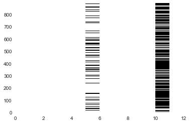
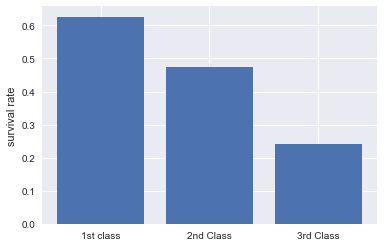
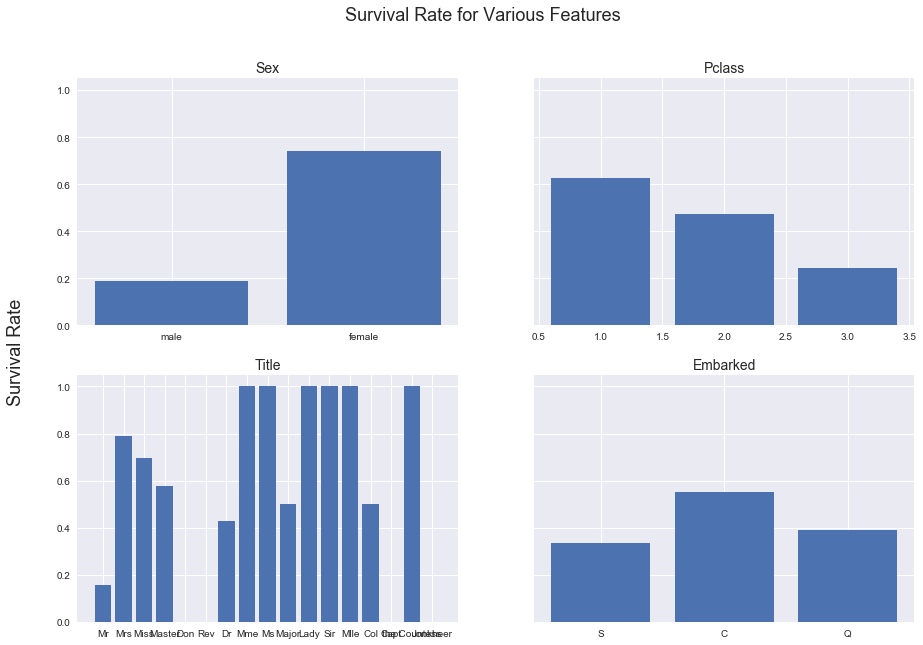

### Step 1: Reading the data
Go to https://www.kaggle.com/c/titanic/data
If you scroll down the page a bit, you'll see a data dictionary explaining each of the columns. Take a minute to familiarize yourself with how the csv is structured.
Download the train.csv file into this project
Create an iPython notebook and load the csv into pandas.


```python
import numpy as np
import pandas as pd
import matplotlib.pyplot as plt
import seaborn as sns

%matplotlib inline
```


```python
data = pd.read_csv('./train.csv')
```


```python
data.head()
```


<div>
<style scoped>
    .dataframe tbody tr th:only-of-type {
        vertical-align: middle;
    }

    .dataframe tbody tr th {
        vertical-align: top;
    }

    .dataframe thead th {
        text-align: right;
    }
</style>
<table border="1" class="dataframe">
  <thead>
    <tr style="text-align: right;">
      <th></th>
      <th>PassengerId</th>
      <th>Survived</th>
      <th>Pclass</th>
      <th>Name</th>
      <th>Sex</th>
      <th>Age</th>
      <th>SibSp</th>
      <th>Parch</th>
      <th>Ticket</th>
      <th>Fare</th>
      <th>Cabin</th>
      <th>Embarked</th>
    </tr>
  </thead>
  <tbody>
    <tr>
      <th>0</th>
      <td>1</td>
      <td>0</td>
      <td>3</td>
      <td>Braund, Mr. Owen Harris</td>
      <td>male</td>
      <td>22.0</td>
      <td>1</td>
      <td>0</td>
      <td>A/5 21171</td>
      <td>7.2500</td>
      <td>NaN</td>
      <td>S</td>
    </tr>
    <tr>
      <th>1</th>
      <td>2</td>
      <td>1</td>
      <td>1</td>
      <td>Cumings, Mrs. John Bradley (Florence Briggs Th...</td>
      <td>female</td>
      <td>38.0</td>
      <td>1</td>
      <td>0</td>
      <td>PC 17599</td>
      <td>71.2833</td>
      <td>C85</td>
      <td>C</td>
    </tr>
    <tr>
      <th>2</th>
      <td>3</td>
      <td>1</td>
      <td>3</td>
      <td>Heikkinen, Miss. Laina</td>
      <td>female</td>
      <td>26.0</td>
      <td>0</td>
      <td>0</td>
      <td>STON/O2. 3101282</td>
      <td>7.9250</td>
      <td>NaN</td>
      <td>S</td>
    </tr>
    <tr>
      <th>3</th>
      <td>4</td>
      <td>1</td>
      <td>1</td>
      <td>Futrelle, Mrs. Jacques Heath (Lily May Peel)</td>
      <td>female</td>
      <td>35.0</td>
      <td>1</td>
      <td>0</td>
      <td>113803</td>
      <td>53.1000</td>
      <td>C123</td>
      <td>S</td>
    </tr>
    <tr>
      <th>4</th>
      <td>5</td>
      <td>0</td>
      <td>3</td>
      <td>Allen, Mr. William Henry</td>
      <td>male</td>
      <td>35.0</td>
      <td>0</td>
      <td>0</td>
      <td>373450</td>
      <td>8.0500</td>
      <td>NaN</td>
      <td>S</td>
    </tr>
  </tbody>
</table>
</div>


### Step 2: Cleaning the data
Create a bar chart showing how many missing values are in each column
Which column has the most NaN values? How many cells in that column are empty?
Delete all rows where Embarked is empty
Fill all empty cabins with ¯\\(ツ)/¯
Note: NaN, empty, and missing are synonymous.


```python
plt.pcolor(data.isnull());
```





```python
data.iloc[:,[5,10]].head(8)
```


<div>
<style scoped>
    .dataframe tbody tr th:only-of-type {
        vertical-align: middle;
    }

    .dataframe tbody tr th {
        vertical-align: top;
    }

    .dataframe thead th {
        text-align: right;
    }
</style>
<table border="1" class="dataframe">
  <thead>
    <tr style="text-align: right;">
      <th></th>
      <th>Age</th>
      <th>Cabin</th>
    </tr>
  </thead>
  <tbody>
    <tr>
      <th>0</th>
      <td>22.0</td>
      <td>NaN</td>
    </tr>
    <tr>
      <th>1</th>
      <td>38.0</td>
      <td>C85</td>
    </tr>
    <tr>
      <th>2</th>
      <td>26.0</td>
      <td>NaN</td>
    </tr>
    <tr>
      <th>3</th>
      <td>35.0</td>
      <td>C123</td>
    </tr>
    <tr>
      <th>4</th>
      <td>35.0</td>
      <td>NaN</td>
    </tr>
    <tr>
      <th>5</th>
      <td>NaN</td>
      <td>NaN</td>
    </tr>
    <tr>
      <th>6</th>
      <td>54.0</td>
      <td>E46</td>
    </tr>
    <tr>
      <th>7</th>
      <td>2.0</td>
      <td>NaN</td>
    </tr>
  </tbody>
</table>
</div>


```python
data.info()
```

    <class 'pandas.core.frame.DataFrame'>
    RangeIndex: 891 entries, 0 to 890
    Data columns (total 12 columns):
    PassengerId    891 non-null int64
    Survived       891 non-null int64
    Pclass         891 non-null int64
    Name           891 non-null object
    Sex            891 non-null object
    Age            714 non-null float64
    SibSp          891 non-null int64
    Parch          891 non-null int64
    Ticket         891 non-null object
    Fare           891 non-null float64
    Cabin          204 non-null object
    Embarked       889 non-null object
    dtypes: float64(2), int64(5), object(5)
    memory usage: 83.6+ KB
    


```python
data.dropna(subset=['Embarked'], inplace=True)
```


```python
data['Cabin'].fillna("¯\\_(ツ)_/¯", inplace=True)
```


```python
data.head()
```


<div>
<style scoped>
    .dataframe tbody tr th:only-of-type {
        vertical-align: middle;
    }

    .dataframe tbody tr th {
        vertical-align: top;
    }

    .dataframe thead th {
        text-align: right;
    }
</style>
<table border="1" class="dataframe">
  <thead>
    <tr style="text-align: right;">
      <th></th>
      <th>PassengerId</th>
      <th>Survived</th>
      <th>Pclass</th>
      <th>Name</th>
      <th>Sex</th>
      <th>Age</th>
      <th>SibSp</th>
      <th>Parch</th>
      <th>Ticket</th>
      <th>Fare</th>
      <th>Cabin</th>
      <th>Embarked</th>
    </tr>
  </thead>
  <tbody>
    <tr>
      <th>0</th>
      <td>1</td>
      <td>0</td>
      <td>3</td>
      <td>Braund, Mr. Owen Harris</td>
      <td>male</td>
      <td>22.0</td>
      <td>1</td>
      <td>0</td>
      <td>A/5 21171</td>
      <td>7.2500</td>
      <td>¯\_(ツ)_/¯</td>
      <td>S</td>
    </tr>
    <tr>
      <th>1</th>
      <td>2</td>
      <td>1</td>
      <td>1</td>
      <td>Cumings, Mrs. John Bradley (Florence Briggs Th...</td>
      <td>female</td>
      <td>38.0</td>
      <td>1</td>
      <td>0</td>
      <td>PC 17599</td>
      <td>71.2833</td>
      <td>C85</td>
      <td>C</td>
    </tr>
    <tr>
      <th>2</th>
      <td>3</td>
      <td>1</td>
      <td>3</td>
      <td>Heikkinen, Miss. Laina</td>
      <td>female</td>
      <td>26.0</td>
      <td>0</td>
      <td>0</td>
      <td>STON/O2. 3101282</td>
      <td>7.9250</td>
      <td>¯\_(ツ)_/¯</td>
      <td>S</td>
    </tr>
    <tr>
      <th>3</th>
      <td>4</td>
      <td>1</td>
      <td>1</td>
      <td>Futrelle, Mrs. Jacques Heath (Lily May Peel)</td>
      <td>female</td>
      <td>35.0</td>
      <td>1</td>
      <td>0</td>
      <td>113803</td>
      <td>53.1000</td>
      <td>C123</td>
      <td>S</td>
    </tr>
    <tr>
      <th>4</th>
      <td>5</td>
      <td>0</td>
      <td>3</td>
      <td>Allen, Mr. William Henry</td>
      <td>male</td>
      <td>35.0</td>
      <td>0</td>
      <td>0</td>
      <td>373450</td>
      <td>8.0500</td>
      <td>¯\_(ツ)_/¯</td>
      <td>S</td>
    </tr>
  </tbody>
</table>
</div>


### Step 3: Feature extraction

1. There are two columns that pertain to how many family members are on the boat for a given person. Create a new column called FamilyCount which will be the sum of those two columns.
2. Reverends have a special title in their name. Create a column called IsReverend: 1 if they're a preacher, 0 if they're not.
3. In order to feed our training data into a classification algorithm, we need to convert our categories into 1's and 0's using pd.get_dummies
4. Create 3 columns: Embarked_C, Embarked_Q and Embarked_S. These columns will have 1's and 0's that correspond to the C, Q and S values in the Embarked column
5. Do the same thing for Sex  
6. **BONUS:** Extract the title from everyone's name and create dummy columns


```python
data['isReverend'] = np.where(data['Name'].str.contains('Rev.'), 1, 0)
```


```python
data[data['isReverend'] ==1]
```


<div>
<style scoped>
    .dataframe tbody tr th:only-of-type {
        vertical-align: middle;
    }

    .dataframe tbody tr th {
        vertical-align: top;
    }

    .dataframe thead th {
        text-align: right;
    }
</style>
<table border="1" class="dataframe">
  <thead>
    <tr style="text-align: right;">
      <th></th>
      <th>PassengerId</th>
      <th>Survived</th>
      <th>Pclass</th>
      <th>Name</th>
      <th>Sex</th>
      <th>Age</th>
      <th>SibSp</th>
      <th>Parch</th>
      <th>Ticket</th>
      <th>Fare</th>
      <th>Cabin</th>
      <th>Embarked</th>
      <th>isReverend</th>
    </tr>
  </thead>
  <tbody>
    <tr>
      <th>149</th>
      <td>150</td>
      <td>0</td>
      <td>2</td>
      <td>Byles, Rev. Thomas Roussel Davids</td>
      <td>male</td>
      <td>42.0</td>
      <td>0</td>
      <td>0</td>
      <td>244310</td>
      <td>13.000</td>
      <td>¯\_(ツ)_/¯</td>
      <td>S</td>
      <td>1</td>
    </tr>
    <tr>
      <th>150</th>
      <td>151</td>
      <td>0</td>
      <td>2</td>
      <td>Bateman, Rev. Robert James</td>
      <td>male</td>
      <td>51.0</td>
      <td>0</td>
      <td>0</td>
      <td>S.O.P. 1166</td>
      <td>12.525</td>
      <td>¯\_(ツ)_/¯</td>
      <td>S</td>
      <td>1</td>
    </tr>
    <tr>
      <th>249</th>
      <td>250</td>
      <td>0</td>
      <td>2</td>
      <td>Carter, Rev. Ernest Courtenay</td>
      <td>male</td>
      <td>54.0</td>
      <td>1</td>
      <td>0</td>
      <td>244252</td>
      <td>26.000</td>
      <td>¯\_(ツ)_/¯</td>
      <td>S</td>
      <td>1</td>
    </tr>
    <tr>
      <th>626</th>
      <td>627</td>
      <td>0</td>
      <td>2</td>
      <td>Kirkland, Rev. Charles Leonard</td>
      <td>male</td>
      <td>57.0</td>
      <td>0</td>
      <td>0</td>
      <td>219533</td>
      <td>12.350</td>
      <td>¯\_(ツ)_/¯</td>
      <td>Q</td>
      <td>1</td>
    </tr>
    <tr>
      <th>848</th>
      <td>849</td>
      <td>0</td>
      <td>2</td>
      <td>Harper, Rev. John</td>
      <td>male</td>
      <td>28.0</td>
      <td>0</td>
      <td>1</td>
      <td>248727</td>
      <td>33.000</td>
      <td>¯\_(ツ)_/¯</td>
      <td>S</td>
      <td>1</td>
    </tr>
    <tr>
      <th>886</th>
      <td>887</td>
      <td>0</td>
      <td>2</td>
      <td>Montvila, Rev. Juozas</td>
      <td>male</td>
      <td>27.0</td>
      <td>0</td>
      <td>0</td>
      <td>211536</td>
      <td>13.000</td>
      <td>¯\_(ツ)_/¯</td>
      <td>S</td>
      <td>1</td>
    </tr>
  </tbody>
</table>
</div>


```python
data['Embarked_C'] = np.where(data['Embarked'] == 'C', 1, 0)
data['Embarked_Q'] = np.where(data['Embarked'] == 'S', 1, 0)
data['Embarked_S'] = np.where(data['Embarked'] == 'Q', 1, 0)
```


```python
print(data[['Embarked_C','Embarked_Q','Embarked_S']].sum())
print(len(data))
```

    Embarked_C    168
    Embarked_Q    644
    Embarked_S     77
    dtype: int64
    889
    


```python
data['Sex_M'] = np.where(data['Sex'] == 'male', 1, 0)
data['Sex_F'] = np.where(data['Sex'] == 'female', 1, 0)
```


```python
data.head(2)
```


<div>
<style scoped>
    .dataframe tbody tr th:only-of-type {
        vertical-align: middle;
    }

    .dataframe tbody tr th {
        vertical-align: top;
    }

    .dataframe thead th {
        text-align: right;
    }
</style>
<table border="1" class="dataframe">
  <thead>
    <tr style="text-align: right;">
      <th></th>
      <th>PassengerId</th>
      <th>Survived</th>
      <th>Pclass</th>
      <th>Name</th>
      <th>Sex</th>
      <th>Age</th>
      <th>SibSp</th>
      <th>Parch</th>
      <th>Ticket</th>
      <th>Fare</th>
      <th>Cabin</th>
      <th>Embarked</th>
      <th>isReverend</th>
      <th>Embarked_C</th>
      <th>Embarked_Q</th>
      <th>Embarked_S</th>
      <th>Sex_M</th>
      <th>Sex_F</th>
    </tr>
  </thead>
  <tbody>
    <tr>
      <th>0</th>
      <td>1</td>
      <td>0</td>
      <td>3</td>
      <td>Braund, Mr. Owen Harris</td>
      <td>male</td>
      <td>22.0</td>
      <td>1</td>
      <td>0</td>
      <td>A/5 21171</td>
      <td>7.2500</td>
      <td>¯\_(ツ)_/¯</td>
      <td>S</td>
      <td>0</td>
      <td>0</td>
      <td>1</td>
      <td>0</td>
      <td>1</td>
      <td>0</td>
    </tr>
    <tr>
      <th>1</th>
      <td>2</td>
      <td>1</td>
      <td>1</td>
      <td>Cumings, Mrs. John Bradley (Florence Briggs Th...</td>
      <td>female</td>
      <td>38.0</td>
      <td>1</td>
      <td>0</td>
      <td>PC 17599</td>
      <td>71.2833</td>
      <td>C85</td>
      <td>C</td>
      <td>0</td>
      <td>1</td>
      <td>0</td>
      <td>0</td>
      <td>0</td>
      <td>1</td>
    </tr>
  </tbody>
</table>
</div>


```python
title = 'Harper, Rev. John'
```


```python
print(title.find(','))
print(title.find('.'))
```

    6
    11
    


```python
tt = title[8:11]
```


```python
tt
```


    'Rev'


```python
title[title.find(',')+2:title.find('.')]
```


    'Rev'


```python
title = data.loc[0,'Name']
```


```python
title[title.find(',')+2:title.find('.')]
```


    'Mr'


```python
data['Title'] = [i[i.find(',')+2:i.find('.')] for i in data['Name']]
```


```python
data[['Name','Title']].head(5)
```


<div>
<style scoped>
    .dataframe tbody tr th:only-of-type {
        vertical-align: middle;
    }

    .dataframe tbody tr th {
        vertical-align: top;
    }

    .dataframe thead th {
        text-align: right;
    }
</style>
<table border="1" class="dataframe">
  <thead>
    <tr style="text-align: right;">
      <th></th>
      <th>Name</th>
      <th>Title</th>
    </tr>
  </thead>
  <tbody>
    <tr>
      <th>0</th>
      <td>Braund, Mr. Owen Harris</td>
      <td>Mr</td>
    </tr>
    <tr>
      <th>1</th>
      <td>Cumings, Mrs. John Bradley (Florence Briggs Th...</td>
      <td>Mrs</td>
    </tr>
    <tr>
      <th>2</th>
      <td>Heikkinen, Miss. Laina</td>
      <td>Miss</td>
    </tr>
    <tr>
      <th>3</th>
      <td>Futrelle, Mrs. Jacques Heath (Lily May Peel)</td>
      <td>Mrs</td>
    </tr>
    <tr>
      <th>4</th>
      <td>Allen, Mr. William Henry</td>
      <td>Mr</td>
    </tr>
  </tbody>
</table>
</div>


### Step 4: Exploratory analysis
1. What was the survival rate overall?
2. Which gender fared the worst? What was their survival rate?
3. What was the survival rate for each Pclass?
4. Did any reverends survive? How many?
5. What is the survival rate for cabins marked ¯\\(ツ)/¯
6. What is the survival rate for people whose Age is empty?
7. What is the survival rate for each port of embarkation?
8. What is the survival rate for children (under 12) in each Pclass?
9. Did the captain of the ship survive? Is he on the list?
10. Of all the people that died, who had the most expensive ticket? How much did it cost?
11. Does having family on the boat help or hurt your chances of survival?


```python
### What was the survival rate overall?
print('Survival rate was {0:.2f}%'.format(data['Survived'].sum() / len(data['Survived'])*100))
```

    Survival rate was 38.25%
    


```python
### Which gender fared the worst? What was their survival rate?
print('Survival rate was {0:.2f}% for males'.format(data[data['Sex'] == 'male']['Survived'].sum() / len(data[data['Sex'] == 'male']['Survived'])*100))
print('Survival rate was {0:.2f}% for females'.format(data[data['Sex'] == 'female']['Survived'].sum() / len(data[data['Sex'] == 'female']['Survived'])*100))
```

    Survival rate was 18.89% for males
    Survival rate was 74.04% for females
    


```python
### What was the survival rate for each Pclass?

# fig, ax = plt.subplots(nrows=1, ncols=3, figsize(15,10));

plt.bar(x=['1st class','2nd Class','3rd Class'], 
        height=[data[data['Pclass'] == 1]['Survived'].sum() / len(data[data['Pclass'] == 1]['Survived']),
         data[data['Pclass'] == 2]['Survived'].sum() / len(data[data['Pclass'] == 2]['Survived']),
         data[data['Pclass'] == 3]['Survived'].sum() / len(data[data['Pclass'] == 3]['Survived'])]);

plt.ylabel('survival rate');
```





```python
print(data[data['Pclass'] == 1]['Survived'].sum() / len(data[data['Pclass'] == 1]['Survived']),
         data[data['Pclass'] == 2]['Survived'].sum() / len(data[data['Pclass'] == 2]['Survived']),
         data[data['Pclass'] == 3]['Survived'].sum() / len(data[data['Pclass'] == 3]['Survived']))
```

    0.6261682242990654 0.47282608695652173 0.24236252545824846
    


```python
### Did any reverends survive? How many?
mask = (data['isReverend'] == 1) & (data['Survived'] == 1)

data[mask]
```


<div>
<style scoped>
    .dataframe tbody tr th:only-of-type {
        vertical-align: middle;
    }

    .dataframe tbody tr th {
        vertical-align: top;
    }

    .dataframe thead th {
        text-align: right;
    }
</style>
<table border="1" class="dataframe">
  <thead>
    <tr style="text-align: right;">
      <th></th>
      <th>PassengerId</th>
      <th>Survived</th>
      <th>Pclass</th>
      <th>Name</th>
      <th>Sex</th>
      <th>Age</th>
      <th>SibSp</th>
      <th>Parch</th>
      <th>Ticket</th>
      <th>Fare</th>
      <th>Cabin</th>
      <th>Embarked</th>
      <th>isReverend</th>
      <th>Embarked_C</th>
      <th>Embarked_Q</th>
      <th>Embarked_S</th>
      <th>Sex_M</th>
      <th>Sex_F</th>
      <th>Title</th>
    </tr>
  </thead>
  <tbody>
  </tbody>
</table>
</div>


- nope, no reverends survived :(


```python
data['Cabin'][0] == '¯\\_(ツ)_/¯'
```


    True


```python
### What is the survival rate for cabins marked ¯\\(ツ)/¯
data[data['Cabin'] == '¯\\_(ツ)_/¯']['Survived'].sum() / len(data[data['Cabin'] == '¯\\_(ツ)_/¯'])
```


    0.29985443959243085


```python
### What is the survival rate for people whose Age is empty?
data[data['Age'].isnull()]['Survived'].sum() / len(data[data['Age'].isnull()]['Survived'])
```


    0.2937853107344633


```python
### What is the survival rate for each port of embarkation?
print(data[data['Embarked_C'] == 1]['Survived'].sum() / len(data[data['Embarked_C'] == 1]['Survived']))
print(data[data['Embarked_Q'] == 1]['Survived'].sum() / len(data[data['Embarked_Q'] == 1]['Survived']))
print(data[data['Embarked_S'] == 1]['Survived'].sum() / len(data[data['Embarked_S'] == 1]['Survived']))
```

    0.5535714285714286
    0.33695652173913043
    0.38961038961038963
    


```python
# ### What is the survival rate for children (under 12) in each Pclass?
child1 = (data['Age'] < 12) & (data['Pclass'] == 1)
child2 = (data['Age'] < 12) & (data['Pclass'] == 2)
child3 = (data['Age'] < 12) & (data['Pclass'] == 3)
```


```python
print(data[child1]['Survived'].sum() / len(data[child1]['Survived']))
print(data[child2]['Survived'].sum() / len(data[child2]['Survived']))
print(data[child3]['Survived'].sum() / len(data[child3]['Survived']))
```

    0.75
    1.0
    0.40425531914893614
    


```python
### Did the captain of the ship survive? Is he on the list?
data[data['Title'] == 'Capt']['Survived']
```


    745    0
    Name: Survived, dtype: int64


**A:** captain did not survive :( [though we knew that from the movie :P]


```python
### Of all the people that died, who had the most expensive ticket? How much did it cost?
data[data['Survived'] == 0][['Name','Fare']].sort_values(by='Fare', ascending=False).head(10)
```


<div>
<style scoped>
    .dataframe tbody tr th:only-of-type {
        vertical-align: middle;
    }

    .dataframe tbody tr th {
        vertical-align: top;
    }

    .dataframe thead th {
        text-align: right;
    }
</style>
<table border="1" class="dataframe">
  <thead>
    <tr style="text-align: right;">
      <th></th>
      <th>Name</th>
      <th>Fare</th>
    </tr>
  </thead>
  <tbody>
    <tr>
      <th>27</th>
      <td>Fortune, Mr. Charles Alexander</td>
      <td>263.0000</td>
    </tr>
    <tr>
      <th>438</th>
      <td>Fortune, Mr. Mark</td>
      <td>263.0000</td>
    </tr>
    <tr>
      <th>118</th>
      <td>Baxter, Mr. Quigg Edmond</td>
      <td>247.5208</td>
    </tr>
    <tr>
      <th>557</th>
      <td>Robbins, Mr. Victor</td>
      <td>227.5250</td>
    </tr>
    <tr>
      <th>527</th>
      <td>Farthing, Mr. John</td>
      <td>221.7792</td>
    </tr>
    <tr>
      <th>377</th>
      <td>Widener, Mr. Harry Elkins</td>
      <td>211.5000</td>
    </tr>
    <tr>
      <th>332</th>
      <td>Graham, Mr. George Edward</td>
      <td>153.4625</td>
    </tr>
    <tr>
      <th>498</th>
      <td>Allison, Mrs. Hudson J C (Bessie Waldo Daniels)</td>
      <td>151.5500</td>
    </tr>
    <tr>
      <th>297</th>
      <td>Allison, Miss. Helen Loraine</td>
      <td>151.5500</td>
    </tr>
    <tr>
      <th>373</th>
      <td>Ringhini, Mr. Sante</td>
      <td>135.6333</td>
    </tr>
  </tbody>
</table>
</div>


**A:** Messrs. Charles Alexander and Mark Fortune (aptly named) were the non-survivors with the most expensive ticket ($263)


```python
### Does having family on the boat help or hurt your chances of survival?
fam_has = (data['SibSp'] > 0)
fam_none = (data['SibSp'] == 0)
```


```python
print(data[fam_has]['Survived'].sum() / len(data[fam_has]['Survived']))
print(data[fam_none]['Survived'].sum() / len(data[fam_none]['Survived']))
```

    0.4664310954063604
    0.3432343234323432
    

**A:** Looks like having family aboard helped survival rate (maybe b/c women, children?)

### Step 5: Plotting
Using Matplotlib and Seaborn, create several charts showing the survival rates of different groups of people. It's fine if a handful of charts are basic (Gender, Age, etc), but what we're really looking for is something beneath the surface.


```python
data.columns
```


    Index(['PassengerId', 'Survived', 'Pclass', 'Name', 'Sex', 'Age', 'SibSp',
           'Parch', 'Ticket', 'Fare', 'Cabin', 'Embarked', 'isReverend',
           'Embarked_C', 'Embarked_Q', 'Embarked_S', 'Sex_M', 'Sex_F', 'Title'],
          dtype='object')


```python
## Worked with Andy on this
def survival_rate(column, condition):
        
    if column not in data.columns:
        print('column does not exist, try again')
        pass
    
    else:
        mask = (data[column] == condition)
    
        rate = data[mask]['Survived'].sum() / len(data[mask]['Survived'])
    
        return rate
```


```python
print(survival_rate('Sex','male'))
print(survival_rate('Sex','female'))
```

    0.18890814558058924
    0.7403846153846154
    


```python
# need to loop through and do fcn 'survival_rate' with unique values of that column
```


```python
[survival_rate('Sex',i) for i in data['Sex'].unique()]
```


    [0.18890814558058924, 0.7403846153846154]


```python
data.columns
```


    Index(['PassengerId', 'Survived', 'Pclass', 'Name', 'Sex', 'Age', 'SibSp',
           'Parch', 'Ticket', 'Fare', 'Cabin', 'Embarked', 'isReverend',
           'Embarked_C', 'Embarked_Q', 'Embarked_S', 'Sex_M', 'Sex_F', 'Title'],
          dtype='object')


```python
fig, ax = plt.subplots(2,2, figsize=(15,10), sharey=True)

fig.suptitle('Survival Rate for Various Features', fontsize=18)

# ax[0,0].fig.text(0.04, 0.5, 'common Y', va='center', rotation='vertical')bar(x=('male', 'female'), height=(survival_rate('Sex','male'), survival_rate('Sex','female')));
ax[0,0].bar(x=list(data['Sex'].unique()), height=[survival_rate('Sex',i) for i in data['Sex'].unique()]);
ax[0,1].bar(x=list(data['Pclass'].unique()), height=[survival_rate('Pclass',i) for i in data['Pclass'].unique()]);
ax[1,0].bar(x=list(data['Title'].unique()), height=[survival_rate('Title',i) for i in data['Title'].unique()]);
ax[1,1].bar(x=list(data['Embarked'].unique()), height=[survival_rate('Embarked',i) for i in data['Embarked'].unique()]);


ax[0,0].set_title('Sex', size=14);
ax[0,1].set_title('Pclass', size=14);
ax[1,0].set_title('Title', size=14);
ax[1,1].set_title('Embarked', size=14);


fig.text(0.06, 0.5, 'Survival Rate', va='center', rotation='vertical', size=18);
```





```python
##### THIS DID NOT WORK ####

# plotcols = ['Pclass', 'Sex', 'Cabin', 'Embarked']

# # fig, ax = plt.subplots(nrows=1, ncols=4, figsize=(8,15));

# for i in range(2):
# #      ax[i].bar(x=data[plotcols[i]].unique(), height=[survival_rate(plotcols[i],i) for i in data[plotcols[i]].unique()]);
# #     print(data[plotcols[i]].unique())
#         ax[i].bar(x=list(data[plotcols[i]].unique()), height=[survival_rate(plotcols[i],j) for j in data[plotcols[0]].unique()]);
```


```python
# [list(data[plotcols[0]].unique()),[survival_rate(plotcols[0],j) for j in data[plotcols[0]].unique()]]
```
