# Project 1

## Step 1: Load the data and perform basic operations.

##### 1. Load the data in using pandas.


```python
import numpy as np
import pandas as pd
```


```python
sat = pd.read_csv('../data/sat.csv', index_col=0)
```


```python
sat.head()
```


<div>
<style scoped>
    .dataframe tbody tr th:only-of-type {
        vertical-align: middle;
    }

    .dataframe tbody tr th {
        vertical-align: top;
    }

    .dataframe thead th {
        text-align: right;
    }
</style>
<table border="1" class="dataframe">
  <thead>
    <tr style="text-align: right;">
      <th></th>
      <th>State</th>
      <th>Participation</th>
      <th>Evidence-Based Reading and Writing</th>
      <th>Math</th>
      <th>Total</th>
    </tr>
  </thead>
  <tbody>
    <tr>
      <th>0</th>
      <td>Alabama</td>
      <td>5%</td>
      <td>593</td>
      <td>572</td>
      <td>1165</td>
    </tr>
    <tr>
      <th>1</th>
      <td>Alaska</td>
      <td>38%</td>
      <td>547</td>
      <td>533</td>
      <td>1080</td>
    </tr>
    <tr>
      <th>2</th>
      <td>Arizona</td>
      <td>30%</td>
      <td>563</td>
      <td>553</td>
      <td>1116</td>
    </tr>
    <tr>
      <th>3</th>
      <td>Arkansas</td>
      <td>3%</td>
      <td>614</td>
      <td>594</td>
      <td>1208</td>
    </tr>
    <tr>
      <th>4</th>
      <td>California</td>
      <td>53%</td>
      <td>531</td>
      <td>524</td>
      <td>1055</td>
    </tr>
  </tbody>
</table>
</div>


```python
act = pd.read_csv('../data/act.csv', index_col=0)
```


```python
act.head()
```


<div>
<style scoped>
    .dataframe tbody tr th:only-of-type {
        vertical-align: middle;
    }

    .dataframe tbody tr th {
        vertical-align: top;
    }

    .dataframe thead th {
        text-align: right;
    }
</style>
<table border="1" class="dataframe">
  <thead>
    <tr style="text-align: right;">
      <th></th>
      <th>State</th>
      <th>Participation</th>
      <th>English</th>
      <th>Math</th>
      <th>Reading</th>
      <th>Science</th>
      <th>Composite</th>
    </tr>
  </thead>
  <tbody>
    <tr>
      <th>0</th>
      <td>National</td>
      <td>60%</td>
      <td>20.3</td>
      <td>20.7</td>
      <td>21.4</td>
      <td>21.0</td>
      <td>21.0</td>
    </tr>
    <tr>
      <th>1</th>
      <td>Alabama</td>
      <td>100%</td>
      <td>18.9</td>
      <td>18.4</td>
      <td>19.7</td>
      <td>19.4</td>
      <td>19.2</td>
    </tr>
    <tr>
      <th>2</th>
      <td>Alaska</td>
      <td>65%</td>
      <td>18.7</td>
      <td>19.8</td>
      <td>20.4</td>
      <td>19.9</td>
      <td>19.8</td>
    </tr>
    <tr>
      <th>3</th>
      <td>Arizona</td>
      <td>62%</td>
      <td>18.6</td>
      <td>19.8</td>
      <td>20.1</td>
      <td>19.8</td>
      <td>19.7</td>
    </tr>
    <tr>
      <th>4</th>
      <td>Arkansas</td>
      <td>100%</td>
      <td>18.9</td>
      <td>19.0</td>
      <td>19.7</td>
      <td>19.5</td>
      <td>19.4</td>
    </tr>
  </tbody>
</table>
</div>


##### 2. Print the first ten rows of each dataframe.


```python
sat.head(10)
```


<div>
<style scoped>
    .dataframe tbody tr th:only-of-type {
        vertical-align: middle;
    }

    .dataframe tbody tr th {
        vertical-align: top;
    }

    .dataframe thead th {
        text-align: right;
    }
</style>
<table border="1" class="dataframe">
  <thead>
    <tr style="text-align: right;">
      <th></th>
      <th>State</th>
      <th>Participation</th>
      <th>Evidence-Based Reading and Writing</th>
      <th>Math</th>
      <th>Total</th>
    </tr>
  </thead>
  <tbody>
    <tr>
      <th>0</th>
      <td>Alabama</td>
      <td>5%</td>
      <td>593</td>
      <td>572</td>
      <td>1165</td>
    </tr>
    <tr>
      <th>1</th>
      <td>Alaska</td>
      <td>38%</td>
      <td>547</td>
      <td>533</td>
      <td>1080</td>
    </tr>
    <tr>
      <th>2</th>
      <td>Arizona</td>
      <td>30%</td>
      <td>563</td>
      <td>553</td>
      <td>1116</td>
    </tr>
    <tr>
      <th>3</th>
      <td>Arkansas</td>
      <td>3%</td>
      <td>614</td>
      <td>594</td>
      <td>1208</td>
    </tr>
    <tr>
      <th>4</th>
      <td>California</td>
      <td>53%</td>
      <td>531</td>
      <td>524</td>
      <td>1055</td>
    </tr>
    <tr>
      <th>5</th>
      <td>Colorado</td>
      <td>11%</td>
      <td>606</td>
      <td>595</td>
      <td>1201</td>
    </tr>
    <tr>
      <th>6</th>
      <td>Connecticut</td>
      <td>100%</td>
      <td>530</td>
      <td>512</td>
      <td>1041</td>
    </tr>
    <tr>
      <th>7</th>
      <td>Delaware</td>
      <td>100%</td>
      <td>503</td>
      <td>492</td>
      <td>996</td>
    </tr>
    <tr>
      <th>8</th>
      <td>District of Columbia</td>
      <td>100%</td>
      <td>482</td>
      <td>468</td>
      <td>950</td>
    </tr>
    <tr>
      <th>9</th>
      <td>Florida</td>
      <td>83%</td>
      <td>520</td>
      <td>497</td>
      <td>1017</td>
    </tr>
  </tbody>
</table>
</div>


```python
act.head(10)
```


<div>
<style scoped>
    .dataframe tbody tr th:only-of-type {
        vertical-align: middle;
    }

    .dataframe tbody tr th {
        vertical-align: top;
    }

    .dataframe thead th {
        text-align: right;
    }
</style>
<table border="1" class="dataframe">
  <thead>
    <tr style="text-align: right;">
      <th></th>
      <th>State</th>
      <th>Participation</th>
      <th>English</th>
      <th>Math</th>
      <th>Reading</th>
      <th>Science</th>
      <th>Composite</th>
    </tr>
  </thead>
  <tbody>
    <tr>
      <th>0</th>
      <td>National</td>
      <td>60%</td>
      <td>20.3</td>
      <td>20.7</td>
      <td>21.4</td>
      <td>21.0</td>
      <td>21.0</td>
    </tr>
    <tr>
      <th>1</th>
      <td>Alabama</td>
      <td>100%</td>
      <td>18.9</td>
      <td>18.4</td>
      <td>19.7</td>
      <td>19.4</td>
      <td>19.2</td>
    </tr>
    <tr>
      <th>2</th>
      <td>Alaska</td>
      <td>65%</td>
      <td>18.7</td>
      <td>19.8</td>
      <td>20.4</td>
      <td>19.9</td>
      <td>19.8</td>
    </tr>
    <tr>
      <th>3</th>
      <td>Arizona</td>
      <td>62%</td>
      <td>18.6</td>
      <td>19.8</td>
      <td>20.1</td>
      <td>19.8</td>
      <td>19.7</td>
    </tr>
    <tr>
      <th>4</th>
      <td>Arkansas</td>
      <td>100%</td>
      <td>18.9</td>
      <td>19.0</td>
      <td>19.7</td>
      <td>19.5</td>
      <td>19.4</td>
    </tr>
    <tr>
      <th>5</th>
      <td>California</td>
      <td>31%</td>
      <td>22.5</td>
      <td>22.7</td>
      <td>23.1</td>
      <td>22.2</td>
      <td>22.8</td>
    </tr>
    <tr>
      <th>6</th>
      <td>Colorado</td>
      <td>100%</td>
      <td>20.1</td>
      <td>20.3</td>
      <td>21.2</td>
      <td>20.9</td>
      <td>20.8</td>
    </tr>
    <tr>
      <th>7</th>
      <td>Connecticut</td>
      <td>31%</td>
      <td>25.5</td>
      <td>24.6</td>
      <td>25.6</td>
      <td>24.6</td>
      <td>25.2</td>
    </tr>
    <tr>
      <th>8</th>
      <td>Delaware</td>
      <td>18%</td>
      <td>24.1</td>
      <td>23.4</td>
      <td>24.8</td>
      <td>23.6</td>
      <td>24.1</td>
    </tr>
    <tr>
      <th>9</th>
      <td>District of Columbia</td>
      <td>32%</td>
      <td>24.4</td>
      <td>23.5</td>
      <td>24.9</td>
      <td>23.5</td>
      <td>24.2</td>
    </tr>
  </tbody>
</table>
</div>


##### 3. Describe in words what each variable (column) is.

### SAT
1. No column header. Looks to be the index.
2. **State**: What state the row of data is for.
3. **Participation:** Percent of HS seniors in that state took the test.
4. **Evidenced-Based Reading and Writing:** Avg. (mean) score for that section of the test.
5. **Math:** Avg. (mean) score for that section of the test.
6. **Total:** Sum of two section scores

### ACT
1. No column header. Looks to be the index.
2. **State**: What state the row of data is for.
3. **Participation:** Percent of HS seniors in that state took the test.
4. **English:** Avg. (mean) score for that section of the test.
5. **Math:** Avg. (mean) score for that section of the test.
6. **Reading:** Avg. (mean) score for that section of the test.
7. **Science:** Avg. (mean) score for that section of the test.
8. **Composite:** Avg. (mean) score for all sections.

##### 4. Does the data look complete? Are there any obvious issues with the observations?

##### 5. Print the types of each column.


```python
sat.info()
```

    <class 'pandas.core.frame.DataFrame'>
    Int64Index: 51 entries, 0 to 50
    Data columns (total 5 columns):
    State                                 51 non-null object
    Participation                         51 non-null object
    Evidence-Based Reading and Writing    51 non-null int64
    Math                                  51 non-null int64
    Total                                 51 non-null int64
    dtypes: int64(3), object(2)
    memory usage: 2.4+ KB
    


```python
act.info()
```

    <class 'pandas.core.frame.DataFrame'>
    Int64Index: 52 entries, 0 to 51
    Data columns (total 7 columns):
    State            52 non-null object
    Participation    52 non-null object
    English          52 non-null float64
    Math             52 non-null float64
    Reading          52 non-null float64
    Science          52 non-null float64
    Composite        52 non-null float64
    dtypes: float64(5), object(2)
    memory usage: 3.2+ KB
    

##### 6. Do any types need to be reassigned? If so, go ahead and do it.

- Participation data type for both sets is 'object' - will go ahead and change them to float.


```python
# checking how to change object % to proper float value
a = sat['Participation'][0]
float(a.strip('%'))/100
```


    0.05


```python
sat['Participation'] = [float(i.strip('%'))/100 for i in sat['Participation']]
```


```python
sat.head()
```


<div>
<style scoped>
    .dataframe tbody tr th:only-of-type {
        vertical-align: middle;
    }

    .dataframe tbody tr th {
        vertical-align: top;
    }

    .dataframe thead th {
        text-align: right;
    }
</style>
<table border="1" class="dataframe">
  <thead>
    <tr style="text-align: right;">
      <th></th>
      <th>State</th>
      <th>Participation</th>
      <th>Evidence-Based Reading and Writing</th>
      <th>Math</th>
      <th>Total</th>
    </tr>
  </thead>
  <tbody>
    <tr>
      <th>0</th>
      <td>Alabama</td>
      <td>0.05</td>
      <td>593</td>
      <td>572</td>
      <td>1165</td>
    </tr>
    <tr>
      <th>1</th>
      <td>Alaska</td>
      <td>0.38</td>
      <td>547</td>
      <td>533</td>
      <td>1080</td>
    </tr>
    <tr>
      <th>2</th>
      <td>Arizona</td>
      <td>0.30</td>
      <td>563</td>
      <td>553</td>
      <td>1116</td>
    </tr>
    <tr>
      <th>3</th>
      <td>Arkansas</td>
      <td>0.03</td>
      <td>614</td>
      <td>594</td>
      <td>1208</td>
    </tr>
    <tr>
      <th>4</th>
      <td>California</td>
      <td>0.53</td>
      <td>531</td>
      <td>524</td>
      <td>1055</td>
    </tr>
  </tbody>
</table>
</div>


```python
act['Participation'] = [float(i.strip('%'))/100 for i in act['Participation']]
```


```python
act.head()
```


<div>
<style scoped>
    .dataframe tbody tr th:only-of-type {
        vertical-align: middle;
    }

    .dataframe tbody tr th {
        vertical-align: top;
    }

    .dataframe thead th {
        text-align: right;
    }
</style>
<table border="1" class="dataframe">
  <thead>
    <tr style="text-align: right;">
      <th></th>
      <th>State</th>
      <th>Participation</th>
      <th>English</th>
      <th>Math</th>
      <th>Reading</th>
      <th>Science</th>
      <th>Composite</th>
    </tr>
  </thead>
  <tbody>
    <tr>
      <th>0</th>
      <td>National</td>
      <td>0.60</td>
      <td>20.3</td>
      <td>20.7</td>
      <td>21.4</td>
      <td>21.0</td>
      <td>21.0</td>
    </tr>
    <tr>
      <th>1</th>
      <td>Alabama</td>
      <td>1.00</td>
      <td>18.9</td>
      <td>18.4</td>
      <td>19.7</td>
      <td>19.4</td>
      <td>19.2</td>
    </tr>
    <tr>
      <th>2</th>
      <td>Alaska</td>
      <td>0.65</td>
      <td>18.7</td>
      <td>19.8</td>
      <td>20.4</td>
      <td>19.9</td>
      <td>19.8</td>
    </tr>
    <tr>
      <th>3</th>
      <td>Arizona</td>
      <td>0.62</td>
      <td>18.6</td>
      <td>19.8</td>
      <td>20.1</td>
      <td>19.8</td>
      <td>19.7</td>
    </tr>
    <tr>
      <th>4</th>
      <td>Arkansas</td>
      <td>1.00</td>
      <td>18.9</td>
      <td>19.0</td>
      <td>19.7</td>
      <td>19.5</td>
      <td>19.4</td>
    </tr>
  </tbody>
</table>
</div>


##### 7. Create a dictionary for each column mapping the State to its respective value for that column. (For example, you should have three SAT dictionaries.)


```python
# # [i for i in sat.columns[2:]]

# # messing around and trying to automate everything. unfortunately can't do that with new dict names
# for i in sat.columns[2:]:
#     for j in range(len(sat)):
#         pass
```


```python
# #longer way
# sat_math = {}
# for i in range(len(sat)):
#     d.update({sat['State'][i]:act['Composite'][i]})
```


```python
# Creating ACT dictionaries, the better comprehension way

act_dict_english = {act['State'][i]:act['English'][i] for i in range(len(act))}
act_dict_math = {act['State'][i]:act['Math'][i] for i in range(len(act))}
act_dict_reading = {act['State'][i]:act['Reading'][i] for i in range(len(act))}
act_dict_science = {act['State'][i]:act['Science'][i] for i in range(len(act))}
act_dict_composite = {act['State'][i]:act['Composite'][i] for i in range(len(act))}
```


```python
# Creating SAT dictionaries, the better comprehension way

sat_dict_ev_read_write = {sat['State'][i]:sat['Evidence-Based Reading and Writing'][i] for i in range(len(sat))}
sat_dict_math = {sat['State'][i]:sat['Math'][i] for i in range(len(sat))}
sat_dict_total = {sat['State'][i]:sat['Total'][i] for i in range(len(sat))}
```

##### 8. Create one dictionary where each key is the column name, and each value is an iterable (a list or a Pandas Series) of all the values in that column.


```python
col_dict = {i:sat[i].values for i in sat.columns}
```


```python
col_dict
```


    {'State': array(['Alabama', 'Alaska', 'Arizona', 'Arkansas', 'California',
            'Colorado', 'Connecticut', 'Delaware', 'District of Columbia',
            'Florida', 'Georgia', 'Hawaii', 'Idaho', 'Illinois', 'Indiana',
            'Iowa', 'Kansas', 'Kentucky', 'Louisiana', 'Maine', 'Maryland',
            'Massachusetts', 'Michigan', 'Minnesota', 'Mississippi',
            'Missouri', 'Montana', 'Nebraska', 'Nevada', 'New Hampshire',
            'New Jersey', 'New Mexico', 'New York', 'North Carolina',
            'North Dakota', 'Ohio', 'Oklahoma', 'Oregon', 'Pennsylvania',
            'Rhode Island', 'South Carolina', 'South Dakota', 'Tennessee',
            'Texas', 'Utah', 'Vermont', 'Virginia', 'Washington',
            'West Virginia', 'Wisconsin', 'Wyoming'], dtype=object),
     'Participation': array([0.05, 0.38, 0.3 , 0.03, 0.53, 0.11, 1.  , 1.  , 1.  , 0.83, 0.61,
            0.55, 0.93, 0.09, 0.63, 0.02, 0.04, 0.04, 0.04, 0.95, 0.69, 0.76,
            1.  , 0.03, 0.02, 0.03, 0.1 , 0.03, 0.26, 0.96, 0.7 , 0.11, 0.67,
            0.49, 0.02, 0.12, 0.07, 0.43, 0.65, 0.71, 0.5 , 0.03, 0.05, 0.62,
            0.03, 0.6 , 0.65, 0.64, 0.14, 0.03, 0.03]),
     'Evidence-Based Reading and Writing': array([593, 547, 563, 614, 531, 606, 530, 503, 482, 520, 535, 544, 513,
            559, 542, 641, 632, 631, 611, 513, 536, 555, 509, 644, 634, 640,
            605, 629, 563, 532, 530, 577, 528, 546, 635, 578, 530, 560, 540,
            539, 543, 612, 623, 513, 624, 562, 561, 541, 558, 642, 626],
           dtype=int64),
     'Math': array([572, 533, 553, 594, 524, 595, 512, 492, 468, 497, 515, 541, 493,
            556, 532, 635, 628, 616, 586, 499,  52, 551, 495, 651, 607, 631,
            591, 625, 553, 520, 526, 561, 523, 535, 621, 570, 517, 548, 531,
            524, 521, 603, 604, 507, 614, 551, 541, 534, 528, 649, 604],
           dtype=int64),
     'Total': array([1165, 1080, 1116, 1208, 1055, 1201, 1041,  996,  950, 1017, 1050,
            1085, 1005, 1115, 1074, 1275, 1260, 1247, 1198, 1012, 1060, 1107,
            1005, 1295, 1242, 1271, 1196, 1253, 1116, 1052, 1056, 1138, 1052,
            1081, 1256, 1149, 1047, 1108, 1071, 1062, 1064, 1216, 1228, 1020,
            1238, 1114, 1102, 1075, 1086, 1291, 1230], dtype=int64)}


##### 9. Merge the dataframes on the state column.


```python
# both = pd.merge(sat, act, how='left',suffixes=('_sat','_act')) -- this did NOT work
# both = pd.concat([sat, act], axis=1, join_axes=[act.index], suffixes=('_sat','_act'))
```


```python
both = pd.merge(act, sat, how='left', on='State', suffixes=('_act','_sat')) 
```


```python
both['State'].unique()
```


    array(['National', 'Alabama', 'Alaska', 'Arizona', 'Arkansas',
           'California', 'Colorado', 'Connecticut', 'Delaware',
           'District of Columbia', 'Florida', 'Georgia', 'Hawaii', 'Idaho',
           'Illinois', 'Indiana', 'Iowa', 'Kansas', 'Kentucky', 'Louisiana',
           'Maine', 'Maryland', 'Massachusetts', 'Michigan', 'Minnesota',
           'Mississippi', 'Missouri', 'Montana', 'Nebraska', 'Nevada',
           'New Hampshire', 'New Jersey', 'New Mexico', 'New York',
           'North Carolina', 'North Dakota', 'Ohio', 'Oklahoma', 'Oregon',
           'Pennsylvania', 'Rhode Island', 'South Carolina', 'South Dakota',
           'Tennessee', 'Texas', 'Utah', 'Vermont', 'Virginia', 'Washington',
           'West Virginia', 'Wisconsin', 'Wyoming'], dtype=object)


```python
both.head()
```


<div>
<style scoped>
    .dataframe tbody tr th:only-of-type {
        vertical-align: middle;
    }

    .dataframe tbody tr th {
        vertical-align: top;
    }

    .dataframe thead th {
        text-align: right;
    }
</style>
<table border="1" class="dataframe">
  <thead>
    <tr style="text-align: right;">
      <th></th>
      <th>State</th>
      <th>Participation_act</th>
      <th>English</th>
      <th>Math_act</th>
      <th>Reading</th>
      <th>Science</th>
      <th>Composite</th>
      <th>Participation_sat</th>
      <th>Evidence-Based Reading and Writing</th>
      <th>Math_sat</th>
      <th>Total</th>
    </tr>
  </thead>
  <tbody>
    <tr>
      <th>0</th>
      <td>National</td>
      <td>0.60</td>
      <td>20.3</td>
      <td>20.7</td>
      <td>21.4</td>
      <td>21.0</td>
      <td>21.0</td>
      <td>NaN</td>
      <td>NaN</td>
      <td>NaN</td>
      <td>NaN</td>
    </tr>
    <tr>
      <th>1</th>
      <td>Alabama</td>
      <td>1.00</td>
      <td>18.9</td>
      <td>18.4</td>
      <td>19.7</td>
      <td>19.4</td>
      <td>19.2</td>
      <td>0.05</td>
      <td>593.0</td>
      <td>572.0</td>
      <td>1165.0</td>
    </tr>
    <tr>
      <th>2</th>
      <td>Alaska</td>
      <td>0.65</td>
      <td>18.7</td>
      <td>19.8</td>
      <td>20.4</td>
      <td>19.9</td>
      <td>19.8</td>
      <td>0.38</td>
      <td>547.0</td>
      <td>533.0</td>
      <td>1080.0</td>
    </tr>
    <tr>
      <th>3</th>
      <td>Arizona</td>
      <td>0.62</td>
      <td>18.6</td>
      <td>19.8</td>
      <td>20.1</td>
      <td>19.8</td>
      <td>19.7</td>
      <td>0.30</td>
      <td>563.0</td>
      <td>553.0</td>
      <td>1116.0</td>
    </tr>
    <tr>
      <th>4</th>
      <td>Arkansas</td>
      <td>1.00</td>
      <td>18.9</td>
      <td>19.0</td>
      <td>19.7</td>
      <td>19.5</td>
      <td>19.4</td>
      <td>0.03</td>
      <td>614.0</td>
      <td>594.0</td>
      <td>1208.0</td>
    </tr>
  </tbody>
</table>
</div>


##### 10. Change the names of the columns so you can distinguish between the SAT columns and the ACT columns.


```python
#first, gonna make everything lower case
lower_names = []
for i in both.columns:
    lower_names.append(i.lower())
```


```python
both.columns = lower_names
```


```python
###### SCRAP THIS VERSION ######

# #then, gonna change the ones we didn't already add a suffix to
# act_cols = ['english', 'reading', 'science', 'composite']
# sat_cols = ['evidence-based reading and writing', 'total']

# act_new_cols = [i+'_act' for i in act_cols]
# sat_new_cols = [i+'_sat' for i in sat_cols]
```


```python
new_cols = ['state', 'participation_act', 'english_act', 'math_act','reading_act', 'science_act','composite_act',
            'participation_sat','evidence-based reading and writing_sat', 'math_sat','total_sat']
```


```python
both.columns = new_cols
```


```python
both.head()
```


<div>
<style scoped>
    .dataframe tbody tr th:only-of-type {
        vertical-align: middle;
    }

    .dataframe tbody tr th {
        vertical-align: top;
    }

    .dataframe thead th {
        text-align: right;
    }
</style>
<table border="1" class="dataframe">
  <thead>
    <tr style="text-align: right;">
      <th></th>
      <th>state</th>
      <th>participation_act</th>
      <th>english_act</th>
      <th>math_act</th>
      <th>reading_act</th>
      <th>science_act</th>
      <th>composite_act</th>
      <th>participation_sat</th>
      <th>evidence-based reading and writing_sat</th>
      <th>math_sat</th>
      <th>total_sat</th>
    </tr>
  </thead>
  <tbody>
    <tr>
      <th>0</th>
      <td>National</td>
      <td>0.60</td>
      <td>20.3</td>
      <td>20.7</td>
      <td>21.4</td>
      <td>21.0</td>
      <td>21.0</td>
      <td>NaN</td>
      <td>NaN</td>
      <td>NaN</td>
      <td>NaN</td>
    </tr>
    <tr>
      <th>1</th>
      <td>Alabama</td>
      <td>1.00</td>
      <td>18.9</td>
      <td>18.4</td>
      <td>19.7</td>
      <td>19.4</td>
      <td>19.2</td>
      <td>0.05</td>
      <td>593.0</td>
      <td>572.0</td>
      <td>1165.0</td>
    </tr>
    <tr>
      <th>2</th>
      <td>Alaska</td>
      <td>0.65</td>
      <td>18.7</td>
      <td>19.8</td>
      <td>20.4</td>
      <td>19.9</td>
      <td>19.8</td>
      <td>0.38</td>
      <td>547.0</td>
      <td>533.0</td>
      <td>1080.0</td>
    </tr>
    <tr>
      <th>3</th>
      <td>Arizona</td>
      <td>0.62</td>
      <td>18.6</td>
      <td>19.8</td>
      <td>20.1</td>
      <td>19.8</td>
      <td>19.7</td>
      <td>0.30</td>
      <td>563.0</td>
      <td>553.0</td>
      <td>1116.0</td>
    </tr>
    <tr>
      <th>4</th>
      <td>Arkansas</td>
      <td>1.00</td>
      <td>18.9</td>
      <td>19.0</td>
      <td>19.7</td>
      <td>19.5</td>
      <td>19.4</td>
      <td>0.03</td>
      <td>614.0</td>
      <td>594.0</td>
      <td>1208.0</td>
    </tr>
  </tbody>
</table>
</div>


```python
both['english_act'].max()
```


    25.5


##### 11. Print the minimum and maximum of each numeric column in the data frame.


```python
# ###### OLD, SLOW WAY #####
# numeric_cols = ['english_act', 'math_sat', 'reading_act', 'science_act', 'composite_act', 
#                 'evidence-based reading and writing_sat', 'math_act', 'total_sat']

# for i in both.columns:
#     if i in numeric_cols:
#         print('Min and Max of {}: ({}, {})'.format(i, both[i].min(),both[i].max()))
```


```python
# #### OLD WAY, WITHOUT PARTICIPATION ####
# numeric_cols = ['english_act', 'math_act', 'reading_act', 'science_act', 'composite_act', 
#                 'evidence-based reading and writing_sat', 'math_sat', 'total_sat']
```


```python
# #### NEW WAY, incl. PARTICIPATION ####
numeric_cols = list(both.columns)[1:]
```


```python
minmax = [(both[i].min(), both[i].max()) for i in both.columns if i in numeric_cols]

for i in range(len(numeric_cols)):
    print('Min and Max of {}: {}'.format(numeric_cols[i], minmax[i]))
```

    Min and Max of participation_act: (0.08, 1.0)
    Min and Max of english_act: (16.3, 25.5)
    Min and Max of math_act: (18.0, 25.3)
    Min and Max of reading_act: (18.1, 26.0)
    Min and Max of science_act: (2.3, 24.9)
    Min and Max of composite_act: (17.8, 25.5)
    Min and Max of participation_sat: (0.02, 1.0)
    Min and Max of evidence-based reading and writing_sat: (482.0, 644.0)
    Min and Max of math_sat: (52.0, 651.0)
    Min and Max of total_sat: (950.0, 1295.0)
    

##### 12. Write a function using only list comprehensions, no loops, to compute standard deviation. Using this function, calculate the standard deviation of each numeric column in both data sets. Add these to a list called `sd`.

$$\sigma = \sqrt{\frac{1}{n}\sum_{i=1}^n(x_i - \mu)^2}$$


```python
def std_dev(sample):
    """Computes standard deviation using list comprehensions."""
    
    std = np.sqrt(np.sum([((i - np.nanmean(sample))**2) for i in sample]) / len(sample))
    
    return std
```


```python
# check that it works!

print(std_dev(both[numeric_cols[0]]))
print(np.std(both[numeric_cols[0]]))
```

    0.3152495020150073
    0.3152495020150073
    


```python
numeric_cols
```


    ['participation_act',
     'english_act',
     'math_act',
     'reading_act',
     'science_act',
     'composite_act',
     'participation_sat',
     'evidence-based reading and writing_sat',
     'math_sat',
     'total_sat']


```python
std_dev(both['evidence-based reading and writing_sat'])
```


    nan


```python
np.nanmean(both['math_sat'])
```


    547.6274509803922


```python
both.head()
```


<div>
<style scoped>
    .dataframe tbody tr th:only-of-type {
        vertical-align: middle;
    }

    .dataframe tbody tr th {
        vertical-align: top;
    }

    .dataframe thead th {
        text-align: right;
    }
</style>
<table border="1" class="dataframe">
  <thead>
    <tr style="text-align: right;">
      <th></th>
      <th>state</th>
      <th>participation_act</th>
      <th>english_act</th>
      <th>math_act</th>
      <th>reading_act</th>
      <th>science_act</th>
      <th>composite_act</th>
      <th>participation_sat</th>
      <th>evidence-based reading and writing_sat</th>
      <th>math_sat</th>
      <th>total_sat</th>
    </tr>
  </thead>
  <tbody>
    <tr>
      <th>0</th>
      <td>National</td>
      <td>0.60</td>
      <td>20.3</td>
      <td>20.7</td>
      <td>21.4</td>
      <td>21.0</td>
      <td>21.0</td>
      <td>NaN</td>
      <td>NaN</td>
      <td>NaN</td>
      <td>NaN</td>
    </tr>
    <tr>
      <th>1</th>
      <td>Alabama</td>
      <td>1.00</td>
      <td>18.9</td>
      <td>18.4</td>
      <td>19.7</td>
      <td>19.4</td>
      <td>19.2</td>
      <td>0.05</td>
      <td>593.0</td>
      <td>572.0</td>
      <td>1165.0</td>
    </tr>
    <tr>
      <th>2</th>
      <td>Alaska</td>
      <td>0.65</td>
      <td>18.7</td>
      <td>19.8</td>
      <td>20.4</td>
      <td>19.9</td>
      <td>19.8</td>
      <td>0.38</td>
      <td>547.0</td>
      <td>533.0</td>
      <td>1080.0</td>
    </tr>
    <tr>
      <th>3</th>
      <td>Arizona</td>
      <td>0.62</td>
      <td>18.6</td>
      <td>19.8</td>
      <td>20.1</td>
      <td>19.8</td>
      <td>19.7</td>
      <td>0.30</td>
      <td>563.0</td>
      <td>553.0</td>
      <td>1116.0</td>
    </tr>
    <tr>
      <th>4</th>
      <td>Arkansas</td>
      <td>1.00</td>
      <td>18.9</td>
      <td>19.0</td>
      <td>19.7</td>
      <td>19.5</td>
      <td>19.4</td>
      <td>0.03</td>
      <td>614.0</td>
      <td>594.0</td>
      <td>1208.0</td>
    </tr>
  </tbody>
</table>
</div>


```python
both.loc[:,['evidence-based reading and writing_sat', 'math_sat', 'total_sat']].head()
```


<div>
<style scoped>
    .dataframe tbody tr th:only-of-type {
        vertical-align: middle;
    }

    .dataframe tbody tr th {
        vertical-align: top;
    }

    .dataframe thead th {
        text-align: right;
    }
</style>
<table border="1" class="dataframe">
  <thead>
    <tr style="text-align: right;">
      <th></th>
      <th>evidence-based reading and writing_sat</th>
      <th>math_sat</th>
      <th>total_sat</th>
    </tr>
  </thead>
  <tbody>
    <tr>
      <th>0</th>
      <td>NaN</td>
      <td>NaN</td>
      <td>NaN</td>
    </tr>
    <tr>
      <th>1</th>
      <td>593.0</td>
      <td>572.0</td>
      <td>1165.0</td>
    </tr>
    <tr>
      <th>2</th>
      <td>547.0</td>
      <td>533.0</td>
      <td>1080.0</td>
    </tr>
    <tr>
      <th>3</th>
      <td>563.0</td>
      <td>553.0</td>
      <td>1116.0</td>
    </tr>
    <tr>
      <th>4</th>
      <td>614.0</td>
      <td>594.0</td>
      <td>1208.0</td>
    </tr>
  </tbody>
</table>
</div>


```python
# dropping NaN national row 
both.dropna(inplace=True)
both.head()
```


<div>
<style scoped>
    .dataframe tbody tr th:only-of-type {
        vertical-align: middle;
    }

    .dataframe tbody tr th {
        vertical-align: top;
    }

    .dataframe thead th {
        text-align: right;
    }
</style>
<table border="1" class="dataframe">
  <thead>
    <tr style="text-align: right;">
      <th></th>
      <th>state</th>
      <th>participation_act</th>
      <th>english_act</th>
      <th>math_act</th>
      <th>reading_act</th>
      <th>science_act</th>
      <th>composite_act</th>
      <th>participation_sat</th>
      <th>evidence-based reading and writing_sat</th>
      <th>math_sat</th>
      <th>total_sat</th>
    </tr>
  </thead>
  <tbody>
    <tr>
      <th>1</th>
      <td>Alabama</td>
      <td>1.00</td>
      <td>18.9</td>
      <td>18.4</td>
      <td>19.7</td>
      <td>19.4</td>
      <td>19.2</td>
      <td>0.05</td>
      <td>593.0</td>
      <td>572.0</td>
      <td>1165.0</td>
    </tr>
    <tr>
      <th>2</th>
      <td>Alaska</td>
      <td>0.65</td>
      <td>18.7</td>
      <td>19.8</td>
      <td>20.4</td>
      <td>19.9</td>
      <td>19.8</td>
      <td>0.38</td>
      <td>547.0</td>
      <td>533.0</td>
      <td>1080.0</td>
    </tr>
    <tr>
      <th>3</th>
      <td>Arizona</td>
      <td>0.62</td>
      <td>18.6</td>
      <td>19.8</td>
      <td>20.1</td>
      <td>19.8</td>
      <td>19.7</td>
      <td>0.30</td>
      <td>563.0</td>
      <td>553.0</td>
      <td>1116.0</td>
    </tr>
    <tr>
      <th>4</th>
      <td>Arkansas</td>
      <td>1.00</td>
      <td>18.9</td>
      <td>19.0</td>
      <td>19.7</td>
      <td>19.5</td>
      <td>19.4</td>
      <td>0.03</td>
      <td>614.0</td>
      <td>594.0</td>
      <td>1208.0</td>
    </tr>
    <tr>
      <th>5</th>
      <td>California</td>
      <td>0.31</td>
      <td>22.5</td>
      <td>22.7</td>
      <td>23.1</td>
      <td>22.2</td>
      <td>22.8</td>
      <td>0.53</td>
      <td>531.0</td>
      <td>524.0</td>
      <td>1055.0</td>
    </tr>
  </tbody>
</table>
</div>


```python
sd = [std_dev(both[i]) for i in numeric_cols]
```


```python
print(sd,'\n', 'len is',len(sd))
```

    [0.31824175751231804, 2.3304876369363368, 1.9624620273436781, 2.046902931484265, 3.151107895464408, 2.0007860815819893, 0.3492907076664507, 45.21697020437866, 84.07255521608297, 91.58351056778743] 
     len is 10
    

## Step 2: Manipulate the dataframe

##### 13. Turn the list `sd` into a new observation in your dataset.


```python
# add a row label that would match up with 'state' to make the sd list the same length as the # of cols in dataframe
sd.insert(0, 'std_dev')
sd
```


    ['std_dev',
     0.31824175751231804,
     2.3304876369363368,
     1.9624620273436781,
     2.046902931484265,
     3.151107895464408,
     2.0007860815819893,
     0.3492907076664507,
     45.21697020437866,
     84.07255521608297,
     91.58351056778743]


```python
both.index[-1]
```


    51


```python
# put it on the end row
both.loc[52] = sd
```


```python
both.tail()
```


<div>
<style scoped>
    .dataframe tbody tr th:only-of-type {
        vertical-align: middle;
    }

    .dataframe tbody tr th {
        vertical-align: top;
    }

    .dataframe thead th {
        text-align: right;
    }
</style>
<table border="1" class="dataframe">
  <thead>
    <tr style="text-align: right;">
      <th></th>
      <th>state</th>
      <th>participation_act</th>
      <th>english_act</th>
      <th>math_act</th>
      <th>reading_act</th>
      <th>science_act</th>
      <th>composite_act</th>
      <th>participation_sat</th>
      <th>evidence-based reading and writing_sat</th>
      <th>math_sat</th>
      <th>total_sat</th>
    </tr>
  </thead>
  <tbody>
    <tr>
      <th>48</th>
      <td>Washington</td>
      <td>0.290000</td>
      <td>20.900000</td>
      <td>21.900000</td>
      <td>22.100000</td>
      <td>22.000000</td>
      <td>21.900000</td>
      <td>0.640000</td>
      <td>541.00000</td>
      <td>534.000000</td>
      <td>1075.000000</td>
    </tr>
    <tr>
      <th>49</th>
      <td>West Virginia</td>
      <td>0.690000</td>
      <td>20.000000</td>
      <td>19.400000</td>
      <td>21.200000</td>
      <td>20.500000</td>
      <td>20.400000</td>
      <td>0.140000</td>
      <td>558.00000</td>
      <td>528.000000</td>
      <td>1086.000000</td>
    </tr>
    <tr>
      <th>50</th>
      <td>Wisconsin</td>
      <td>1.000000</td>
      <td>19.700000</td>
      <td>20.400000</td>
      <td>20.600000</td>
      <td>20.900000</td>
      <td>20.500000</td>
      <td>0.030000</td>
      <td>642.00000</td>
      <td>649.000000</td>
      <td>1291.000000</td>
    </tr>
    <tr>
      <th>51</th>
      <td>Wyoming</td>
      <td>1.000000</td>
      <td>19.400000</td>
      <td>19.800000</td>
      <td>20.800000</td>
      <td>20.600000</td>
      <td>20.200000</td>
      <td>0.030000</td>
      <td>626.00000</td>
      <td>604.000000</td>
      <td>1230.000000</td>
    </tr>
    <tr>
      <th>52</th>
      <td>std_dev</td>
      <td>0.318242</td>
      <td>2.330488</td>
      <td>1.962462</td>
      <td>2.046903</td>
      <td>3.151108</td>
      <td>2.000786</td>
      <td>0.349291</td>
      <td>45.21697</td>
      <td>84.072555</td>
      <td>91.583511</td>
    </tr>
  </tbody>
</table>
</div>


##### 14. Sort the dataframe by the values in a numeric column (e.g. observations descending by SAT participation rate)


```python
both.sort_values(by='total_sat', ascending=False)
```


<div>
<style scoped>
    .dataframe tbody tr th:only-of-type {
        vertical-align: middle;
    }

    .dataframe tbody tr th {
        vertical-align: top;
    }

    .dataframe thead th {
        text-align: right;
    }
</style>
<table border="1" class="dataframe">
  <thead>
    <tr style="text-align: right;">
      <th></th>
      <th>state</th>
      <th>participation_act</th>
      <th>english_act</th>
      <th>math_act</th>
      <th>reading_act</th>
      <th>science_act</th>
      <th>composite_act</th>
      <th>participation_sat</th>
      <th>evidence-based reading and writing_sat</th>
      <th>math_sat</th>
      <th>total_sat</th>
    </tr>
  </thead>
  <tbody>
    <tr>
      <th>24</th>
      <td>Minnesota</td>
      <td>1.000000</td>
      <td>20.400000</td>
      <td>21.500000</td>
      <td>21.800000</td>
      <td>21.600000</td>
      <td>21.500000</td>
      <td>0.030000</td>
      <td>644.00000</td>
      <td>651.000000</td>
      <td>1295.000000</td>
    </tr>
    <tr>
      <th>50</th>
      <td>Wisconsin</td>
      <td>1.000000</td>
      <td>19.700000</td>
      <td>20.400000</td>
      <td>20.600000</td>
      <td>20.900000</td>
      <td>20.500000</td>
      <td>0.030000</td>
      <td>642.00000</td>
      <td>649.000000</td>
      <td>1291.000000</td>
    </tr>
    <tr>
      <th>16</th>
      <td>Iowa</td>
      <td>0.670000</td>
      <td>21.200000</td>
      <td>21.300000</td>
      <td>22.600000</td>
      <td>22.100000</td>
      <td>21.900000</td>
      <td>0.020000</td>
      <td>641.00000</td>
      <td>635.000000</td>
      <td>1275.000000</td>
    </tr>
    <tr>
      <th>26</th>
      <td>Missouri</td>
      <td>1.000000</td>
      <td>19.800000</td>
      <td>19.900000</td>
      <td>20.800000</td>
      <td>20.500000</td>
      <td>20.400000</td>
      <td>0.030000</td>
      <td>640.00000</td>
      <td>631.000000</td>
      <td>1271.000000</td>
    </tr>
    <tr>
      <th>17</th>
      <td>Kansas</td>
      <td>0.730000</td>
      <td>21.100000</td>
      <td>21.300000</td>
      <td>22.300000</td>
      <td>21.700000</td>
      <td>21.700000</td>
      <td>0.040000</td>
      <td>632.00000</td>
      <td>628.000000</td>
      <td>1260.000000</td>
    </tr>
    <tr>
      <th>35</th>
      <td>North Dakota</td>
      <td>0.980000</td>
      <td>19.000000</td>
      <td>20.400000</td>
      <td>20.500000</td>
      <td>20.600000</td>
      <td>20.300000</td>
      <td>0.020000</td>
      <td>635.00000</td>
      <td>621.000000</td>
      <td>1256.000000</td>
    </tr>
    <tr>
      <th>28</th>
      <td>Nebraska</td>
      <td>0.840000</td>
      <td>20.900000</td>
      <td>20.900000</td>
      <td>21.900000</td>
      <td>21.500000</td>
      <td>21.400000</td>
      <td>0.030000</td>
      <td>629.00000</td>
      <td>625.000000</td>
      <td>1253.000000</td>
    </tr>
    <tr>
      <th>18</th>
      <td>Kentucky</td>
      <td>1.000000</td>
      <td>19.600000</td>
      <td>19.400000</td>
      <td>20.500000</td>
      <td>20.100000</td>
      <td>20.000000</td>
      <td>0.040000</td>
      <td>631.00000</td>
      <td>616.000000</td>
      <td>1247.000000</td>
    </tr>
    <tr>
      <th>25</th>
      <td>Mississippi</td>
      <td>1.000000</td>
      <td>18.200000</td>
      <td>18.100000</td>
      <td>18.800000</td>
      <td>18.800000</td>
      <td>18.600000</td>
      <td>0.020000</td>
      <td>634.00000</td>
      <td>607.000000</td>
      <td>1242.000000</td>
    </tr>
    <tr>
      <th>45</th>
      <td>Utah</td>
      <td>1.000000</td>
      <td>19.500000</td>
      <td>19.900000</td>
      <td>20.800000</td>
      <td>20.600000</td>
      <td>20.300000</td>
      <td>0.030000</td>
      <td>624.00000</td>
      <td>614.000000</td>
      <td>1238.000000</td>
    </tr>
    <tr>
      <th>51</th>
      <td>Wyoming</td>
      <td>1.000000</td>
      <td>19.400000</td>
      <td>19.800000</td>
      <td>20.800000</td>
      <td>20.600000</td>
      <td>20.200000</td>
      <td>0.030000</td>
      <td>626.00000</td>
      <td>604.000000</td>
      <td>1230.000000</td>
    </tr>
    <tr>
      <th>43</th>
      <td>Tennessee</td>
      <td>1.000000</td>
      <td>19.500000</td>
      <td>19.200000</td>
      <td>20.100000</td>
      <td>19.900000</td>
      <td>19.800000</td>
      <td>0.050000</td>
      <td>623.00000</td>
      <td>604.000000</td>
      <td>1228.000000</td>
    </tr>
    <tr>
      <th>42</th>
      <td>South Dakota</td>
      <td>0.800000</td>
      <td>20.700000</td>
      <td>21.500000</td>
      <td>22.300000</td>
      <td>22.000000</td>
      <td>21.800000</td>
      <td>0.030000</td>
      <td>612.00000</td>
      <td>603.000000</td>
      <td>1216.000000</td>
    </tr>
    <tr>
      <th>4</th>
      <td>Arkansas</td>
      <td>1.000000</td>
      <td>18.900000</td>
      <td>19.000000</td>
      <td>19.700000</td>
      <td>19.500000</td>
      <td>19.400000</td>
      <td>0.030000</td>
      <td>614.00000</td>
      <td>594.000000</td>
      <td>1208.000000</td>
    </tr>
    <tr>
      <th>6</th>
      <td>Colorado</td>
      <td>1.000000</td>
      <td>20.100000</td>
      <td>20.300000</td>
      <td>21.200000</td>
      <td>20.900000</td>
      <td>20.800000</td>
      <td>0.110000</td>
      <td>606.00000</td>
      <td>595.000000</td>
      <td>1201.000000</td>
    </tr>
    <tr>
      <th>19</th>
      <td>Louisiana</td>
      <td>1.000000</td>
      <td>19.400000</td>
      <td>18.800000</td>
      <td>19.800000</td>
      <td>19.600000</td>
      <td>19.500000</td>
      <td>0.040000</td>
      <td>611.00000</td>
      <td>586.000000</td>
      <td>1198.000000</td>
    </tr>
    <tr>
      <th>27</th>
      <td>Montana</td>
      <td>1.000000</td>
      <td>19.000000</td>
      <td>20.200000</td>
      <td>21.000000</td>
      <td>20.500000</td>
      <td>20.300000</td>
      <td>0.100000</td>
      <td>605.00000</td>
      <td>591.000000</td>
      <td>1196.000000</td>
    </tr>
    <tr>
      <th>1</th>
      <td>Alabama</td>
      <td>1.000000</td>
      <td>18.900000</td>
      <td>18.400000</td>
      <td>19.700000</td>
      <td>19.400000</td>
      <td>19.200000</td>
      <td>0.050000</td>
      <td>593.00000</td>
      <td>572.000000</td>
      <td>1165.000000</td>
    </tr>
    <tr>
      <th>36</th>
      <td>Ohio</td>
      <td>0.750000</td>
      <td>21.200000</td>
      <td>21.600000</td>
      <td>22.500000</td>
      <td>22.000000</td>
      <td>22.000000</td>
      <td>0.120000</td>
      <td>578.00000</td>
      <td>570.000000</td>
      <td>1149.000000</td>
    </tr>
    <tr>
      <th>32</th>
      <td>New Mexico</td>
      <td>0.660000</td>
      <td>18.600000</td>
      <td>19.400000</td>
      <td>20.400000</td>
      <td>20.000000</td>
      <td>19.700000</td>
      <td>0.110000</td>
      <td>577.00000</td>
      <td>561.000000</td>
      <td>1138.000000</td>
    </tr>
    <tr>
      <th>3</th>
      <td>Arizona</td>
      <td>0.620000</td>
      <td>18.600000</td>
      <td>19.800000</td>
      <td>20.100000</td>
      <td>19.800000</td>
      <td>19.700000</td>
      <td>0.300000</td>
      <td>563.00000</td>
      <td>553.000000</td>
      <td>1116.000000</td>
    </tr>
    <tr>
      <th>29</th>
      <td>Nevada</td>
      <td>1.000000</td>
      <td>16.300000</td>
      <td>18.000000</td>
      <td>18.100000</td>
      <td>18.200000</td>
      <td>17.800000</td>
      <td>0.260000</td>
      <td>563.00000</td>
      <td>553.000000</td>
      <td>1116.000000</td>
    </tr>
    <tr>
      <th>14</th>
      <td>Illinois</td>
      <td>0.930000</td>
      <td>21.000000</td>
      <td>21.200000</td>
      <td>21.600000</td>
      <td>21.300000</td>
      <td>21.400000</td>
      <td>0.090000</td>
      <td>559.00000</td>
      <td>556.000000</td>
      <td>1115.000000</td>
    </tr>
    <tr>
      <th>46</th>
      <td>Vermont</td>
      <td>0.290000</td>
      <td>23.300000</td>
      <td>23.100000</td>
      <td>24.400000</td>
      <td>23.200000</td>
      <td>23.600000</td>
      <td>0.600000</td>
      <td>562.00000</td>
      <td>551.000000</td>
      <td>1114.000000</td>
    </tr>
    <tr>
      <th>38</th>
      <td>Oregon</td>
      <td>0.400000</td>
      <td>21.200000</td>
      <td>21.500000</td>
      <td>22.400000</td>
      <td>21.700000</td>
      <td>21.800000</td>
      <td>0.430000</td>
      <td>560.00000</td>
      <td>548.000000</td>
      <td>1108.000000</td>
    </tr>
    <tr>
      <th>22</th>
      <td>Massachusetts</td>
      <td>0.290000</td>
      <td>25.400000</td>
      <td>25.300000</td>
      <td>25.900000</td>
      <td>24.700000</td>
      <td>25.400000</td>
      <td>0.760000</td>
      <td>555.00000</td>
      <td>551.000000</td>
      <td>1107.000000</td>
    </tr>
    <tr>
      <th>47</th>
      <td>Virginia</td>
      <td>0.290000</td>
      <td>23.500000</td>
      <td>23.300000</td>
      <td>24.600000</td>
      <td>23.500000</td>
      <td>23.800000</td>
      <td>0.650000</td>
      <td>561.00000</td>
      <td>541.000000</td>
      <td>1102.000000</td>
    </tr>
    <tr>
      <th>49</th>
      <td>West Virginia</td>
      <td>0.690000</td>
      <td>20.000000</td>
      <td>19.400000</td>
      <td>21.200000</td>
      <td>20.500000</td>
      <td>20.400000</td>
      <td>0.140000</td>
      <td>558.00000</td>
      <td>528.000000</td>
      <td>1086.000000</td>
    </tr>
    <tr>
      <th>12</th>
      <td>Hawaii</td>
      <td>0.900000</td>
      <td>17.800000</td>
      <td>19.200000</td>
      <td>19.200000</td>
      <td>19.300000</td>
      <td>19.000000</td>
      <td>0.550000</td>
      <td>544.00000</td>
      <td>541.000000</td>
      <td>1085.000000</td>
    </tr>
    <tr>
      <th>34</th>
      <td>North Carolina</td>
      <td>1.000000</td>
      <td>17.800000</td>
      <td>19.300000</td>
      <td>19.600000</td>
      <td>19.300000</td>
      <td>19.100000</td>
      <td>0.490000</td>
      <td>546.00000</td>
      <td>535.000000</td>
      <td>1081.000000</td>
    </tr>
    <tr>
      <th>2</th>
      <td>Alaska</td>
      <td>0.650000</td>
      <td>18.700000</td>
      <td>19.800000</td>
      <td>20.400000</td>
      <td>19.900000</td>
      <td>19.800000</td>
      <td>0.380000</td>
      <td>547.00000</td>
      <td>533.000000</td>
      <td>1080.000000</td>
    </tr>
    <tr>
      <th>48</th>
      <td>Washington</td>
      <td>0.290000</td>
      <td>20.900000</td>
      <td>21.900000</td>
      <td>22.100000</td>
      <td>22.000000</td>
      <td>21.900000</td>
      <td>0.640000</td>
      <td>541.00000</td>
      <td>534.000000</td>
      <td>1075.000000</td>
    </tr>
    <tr>
      <th>15</th>
      <td>Indiana</td>
      <td>0.350000</td>
      <td>22.000000</td>
      <td>22.400000</td>
      <td>23.200000</td>
      <td>22.300000</td>
      <td>22.600000</td>
      <td>0.630000</td>
      <td>542.00000</td>
      <td>532.000000</td>
      <td>1074.000000</td>
    </tr>
    <tr>
      <th>39</th>
      <td>Pennsylvania</td>
      <td>0.230000</td>
      <td>23.400000</td>
      <td>23.400000</td>
      <td>24.200000</td>
      <td>23.300000</td>
      <td>23.700000</td>
      <td>0.650000</td>
      <td>540.00000</td>
      <td>531.000000</td>
      <td>1071.000000</td>
    </tr>
    <tr>
      <th>41</th>
      <td>South Carolina</td>
      <td>1.000000</td>
      <td>17.500000</td>
      <td>18.600000</td>
      <td>19.100000</td>
      <td>18.900000</td>
      <td>18.700000</td>
      <td>0.500000</td>
      <td>543.00000</td>
      <td>521.000000</td>
      <td>1064.000000</td>
    </tr>
    <tr>
      <th>40</th>
      <td>Rhode Island</td>
      <td>0.210000</td>
      <td>24.000000</td>
      <td>23.300000</td>
      <td>24.700000</td>
      <td>23.400000</td>
      <td>24.000000</td>
      <td>0.710000</td>
      <td>539.00000</td>
      <td>524.000000</td>
      <td>1062.000000</td>
    </tr>
    <tr>
      <th>21</th>
      <td>Maryland</td>
      <td>0.280000</td>
      <td>23.300000</td>
      <td>23.100000</td>
      <td>24.200000</td>
      <td>2.300000</td>
      <td>23.600000</td>
      <td>0.690000</td>
      <td>536.00000</td>
      <td>52.000000</td>
      <td>1060.000000</td>
    </tr>
    <tr>
      <th>31</th>
      <td>New Jersey</td>
      <td>0.340000</td>
      <td>23.800000</td>
      <td>23.800000</td>
      <td>24.100000</td>
      <td>23.200000</td>
      <td>23.900000</td>
      <td>0.700000</td>
      <td>530.00000</td>
      <td>526.000000</td>
      <td>1056.000000</td>
    </tr>
    <tr>
      <th>5</th>
      <td>California</td>
      <td>0.310000</td>
      <td>22.500000</td>
      <td>22.700000</td>
      <td>23.100000</td>
      <td>22.200000</td>
      <td>22.800000</td>
      <td>0.530000</td>
      <td>531.00000</td>
      <td>524.000000</td>
      <td>1055.000000</td>
    </tr>
    <tr>
      <th>33</th>
      <td>New York</td>
      <td>0.310000</td>
      <td>23.800000</td>
      <td>24.000000</td>
      <td>24.600000</td>
      <td>23.900000</td>
      <td>24.200000</td>
      <td>0.670000</td>
      <td>528.00000</td>
      <td>523.000000</td>
      <td>1052.000000</td>
    </tr>
    <tr>
      <th>30</th>
      <td>New Hampshire</td>
      <td>0.180000</td>
      <td>25.400000</td>
      <td>25.100000</td>
      <td>26.000000</td>
      <td>24.900000</td>
      <td>25.500000</td>
      <td>0.960000</td>
      <td>532.00000</td>
      <td>520.000000</td>
      <td>1052.000000</td>
    </tr>
    <tr>
      <th>11</th>
      <td>Georgia</td>
      <td>0.550000</td>
      <td>21.000000</td>
      <td>20.900000</td>
      <td>22.000000</td>
      <td>21.300000</td>
      <td>21.400000</td>
      <td>0.610000</td>
      <td>535.00000</td>
      <td>515.000000</td>
      <td>1050.000000</td>
    </tr>
    <tr>
      <th>37</th>
      <td>Oklahoma</td>
      <td>1.000000</td>
      <td>18.500000</td>
      <td>18.800000</td>
      <td>20.100000</td>
      <td>19.600000</td>
      <td>19.400000</td>
      <td>0.070000</td>
      <td>530.00000</td>
      <td>517.000000</td>
      <td>1047.000000</td>
    </tr>
    <tr>
      <th>7</th>
      <td>Connecticut</td>
      <td>0.310000</td>
      <td>25.500000</td>
      <td>24.600000</td>
      <td>25.600000</td>
      <td>24.600000</td>
      <td>25.200000</td>
      <td>1.000000</td>
      <td>530.00000</td>
      <td>512.000000</td>
      <td>1041.000000</td>
    </tr>
    <tr>
      <th>44</th>
      <td>Texas</td>
      <td>0.450000</td>
      <td>19.500000</td>
      <td>20.700000</td>
      <td>21.100000</td>
      <td>20.900000</td>
      <td>20.700000</td>
      <td>0.620000</td>
      <td>513.00000</td>
      <td>507.000000</td>
      <td>1020.000000</td>
    </tr>
    <tr>
      <th>10</th>
      <td>Florida</td>
      <td>0.730000</td>
      <td>19.000000</td>
      <td>19.400000</td>
      <td>21.000000</td>
      <td>19.400000</td>
      <td>19.800000</td>
      <td>0.830000</td>
      <td>520.00000</td>
      <td>497.000000</td>
      <td>1017.000000</td>
    </tr>
    <tr>
      <th>20</th>
      <td>Maine</td>
      <td>0.080000</td>
      <td>24.200000</td>
      <td>24.000000</td>
      <td>24.800000</td>
      <td>23.700000</td>
      <td>24.300000</td>
      <td>0.950000</td>
      <td>513.00000</td>
      <td>499.000000</td>
      <td>1012.000000</td>
    </tr>
    <tr>
      <th>13</th>
      <td>Idaho</td>
      <td>0.380000</td>
      <td>21.900000</td>
      <td>21.800000</td>
      <td>23.000000</td>
      <td>22.100000</td>
      <td>22.300000</td>
      <td>0.930000</td>
      <td>513.00000</td>
      <td>493.000000</td>
      <td>1005.000000</td>
    </tr>
    <tr>
      <th>23</th>
      <td>Michigan</td>
      <td>0.290000</td>
      <td>24.100000</td>
      <td>23.700000</td>
      <td>24.500000</td>
      <td>23.800000</td>
      <td>24.100000</td>
      <td>1.000000</td>
      <td>509.00000</td>
      <td>495.000000</td>
      <td>1005.000000</td>
    </tr>
    <tr>
      <th>8</th>
      <td>Delaware</td>
      <td>0.180000</td>
      <td>24.100000</td>
      <td>23.400000</td>
      <td>24.800000</td>
      <td>23.600000</td>
      <td>24.100000</td>
      <td>1.000000</td>
      <td>503.00000</td>
      <td>492.000000</td>
      <td>996.000000</td>
    </tr>
    <tr>
      <th>9</th>
      <td>District of Columbia</td>
      <td>0.320000</td>
      <td>24.400000</td>
      <td>23.500000</td>
      <td>24.900000</td>
      <td>23.500000</td>
      <td>24.200000</td>
      <td>1.000000</td>
      <td>482.00000</td>
      <td>468.000000</td>
      <td>950.000000</td>
    </tr>
    <tr>
      <th>52</th>
      <td>std_dev</td>
      <td>0.318242</td>
      <td>2.330488</td>
      <td>1.962462</td>
      <td>2.046903</td>
      <td>3.151108</td>
      <td>2.000786</td>
      <td>0.349291</td>
      <td>45.21697</td>
      <td>84.072555</td>
      <td>91.583511</td>
    </tr>
  </tbody>
</table>
</div>


##### 15. Use a boolean filter to display only observations with a score above a certain threshold (e.g. only states with a participation rate above 50%)


```python
both[both['math_sat'] >= 600]
```


<div>
<style scoped>
    .dataframe tbody tr th:only-of-type {
        vertical-align: middle;
    }

    .dataframe tbody tr th {
        vertical-align: top;
    }

    .dataframe thead th {
        text-align: right;
    }
</style>
<table border="1" class="dataframe">
  <thead>
    <tr style="text-align: right;">
      <th></th>
      <th>state</th>
      <th>participation_act</th>
      <th>english_act</th>
      <th>math_act</th>
      <th>reading_act</th>
      <th>science_act</th>
      <th>composite_act</th>
      <th>participation_sat</th>
      <th>evidence-based reading and writing_sat</th>
      <th>math_sat</th>
      <th>total_sat</th>
    </tr>
  </thead>
  <tbody>
    <tr>
      <th>16</th>
      <td>Iowa</td>
      <td>0.67</td>
      <td>21.2</td>
      <td>21.3</td>
      <td>22.6</td>
      <td>22.1</td>
      <td>21.9</td>
      <td>0.02</td>
      <td>641.0</td>
      <td>635.0</td>
      <td>1275.0</td>
    </tr>
    <tr>
      <th>17</th>
      <td>Kansas</td>
      <td>0.73</td>
      <td>21.1</td>
      <td>21.3</td>
      <td>22.3</td>
      <td>21.7</td>
      <td>21.7</td>
      <td>0.04</td>
      <td>632.0</td>
      <td>628.0</td>
      <td>1260.0</td>
    </tr>
    <tr>
      <th>18</th>
      <td>Kentucky</td>
      <td>1.00</td>
      <td>19.6</td>
      <td>19.4</td>
      <td>20.5</td>
      <td>20.1</td>
      <td>20.0</td>
      <td>0.04</td>
      <td>631.0</td>
      <td>616.0</td>
      <td>1247.0</td>
    </tr>
    <tr>
      <th>24</th>
      <td>Minnesota</td>
      <td>1.00</td>
      <td>20.4</td>
      <td>21.5</td>
      <td>21.8</td>
      <td>21.6</td>
      <td>21.5</td>
      <td>0.03</td>
      <td>644.0</td>
      <td>651.0</td>
      <td>1295.0</td>
    </tr>
    <tr>
      <th>25</th>
      <td>Mississippi</td>
      <td>1.00</td>
      <td>18.2</td>
      <td>18.1</td>
      <td>18.8</td>
      <td>18.8</td>
      <td>18.6</td>
      <td>0.02</td>
      <td>634.0</td>
      <td>607.0</td>
      <td>1242.0</td>
    </tr>
    <tr>
      <th>26</th>
      <td>Missouri</td>
      <td>1.00</td>
      <td>19.8</td>
      <td>19.9</td>
      <td>20.8</td>
      <td>20.5</td>
      <td>20.4</td>
      <td>0.03</td>
      <td>640.0</td>
      <td>631.0</td>
      <td>1271.0</td>
    </tr>
    <tr>
      <th>28</th>
      <td>Nebraska</td>
      <td>0.84</td>
      <td>20.9</td>
      <td>20.9</td>
      <td>21.9</td>
      <td>21.5</td>
      <td>21.4</td>
      <td>0.03</td>
      <td>629.0</td>
      <td>625.0</td>
      <td>1253.0</td>
    </tr>
    <tr>
      <th>35</th>
      <td>North Dakota</td>
      <td>0.98</td>
      <td>19.0</td>
      <td>20.4</td>
      <td>20.5</td>
      <td>20.6</td>
      <td>20.3</td>
      <td>0.02</td>
      <td>635.0</td>
      <td>621.0</td>
      <td>1256.0</td>
    </tr>
    <tr>
      <th>42</th>
      <td>South Dakota</td>
      <td>0.80</td>
      <td>20.7</td>
      <td>21.5</td>
      <td>22.3</td>
      <td>22.0</td>
      <td>21.8</td>
      <td>0.03</td>
      <td>612.0</td>
      <td>603.0</td>
      <td>1216.0</td>
    </tr>
    <tr>
      <th>43</th>
      <td>Tennessee</td>
      <td>1.00</td>
      <td>19.5</td>
      <td>19.2</td>
      <td>20.1</td>
      <td>19.9</td>
      <td>19.8</td>
      <td>0.05</td>
      <td>623.0</td>
      <td>604.0</td>
      <td>1228.0</td>
    </tr>
    <tr>
      <th>45</th>
      <td>Utah</td>
      <td>1.00</td>
      <td>19.5</td>
      <td>19.9</td>
      <td>20.8</td>
      <td>20.6</td>
      <td>20.3</td>
      <td>0.03</td>
      <td>624.0</td>
      <td>614.0</td>
      <td>1238.0</td>
    </tr>
    <tr>
      <th>50</th>
      <td>Wisconsin</td>
      <td>1.00</td>
      <td>19.7</td>
      <td>20.4</td>
      <td>20.6</td>
      <td>20.9</td>
      <td>20.5</td>
      <td>0.03</td>
      <td>642.0</td>
      <td>649.0</td>
      <td>1291.0</td>
    </tr>
    <tr>
      <th>51</th>
      <td>Wyoming</td>
      <td>1.00</td>
      <td>19.4</td>
      <td>19.8</td>
      <td>20.8</td>
      <td>20.6</td>
      <td>20.2</td>
      <td>0.03</td>
      <td>626.0</td>
      <td>604.0</td>
      <td>1230.0</td>
    </tr>
  </tbody>
</table>
</div>


## Step 3: Visualize the data

##### 16. Using MatPlotLib and PyPlot, plot the distribution of the Rate columns for both SAT and ACT using histograms. (You should have two histograms. You might find [this link](https://matplotlib.org/users/pyplot_tutorial.html#working-with-multiple-figures-and-axes) helpful in organizing one plot above the other.) 


```python
import matplotlib.pyplot as plt
import seaborn as sns

%matplotlib inline
```


```python
fig, ax = plt.subplots(1,2, figsize=(15,8))

fig.suptitle('Participation Rates for ACT and SAT', fontsize=16)

ax[0].hist(both[both['state'] != 'std_dev'].loc[:,'participation_act']);
ax[0].set(title='ACT Participation');

ax[1].hist(both[both['state'] != 'std_dev'].loc[:,'participation_sat']);
ax[1].set(title='SAT Participation');
```


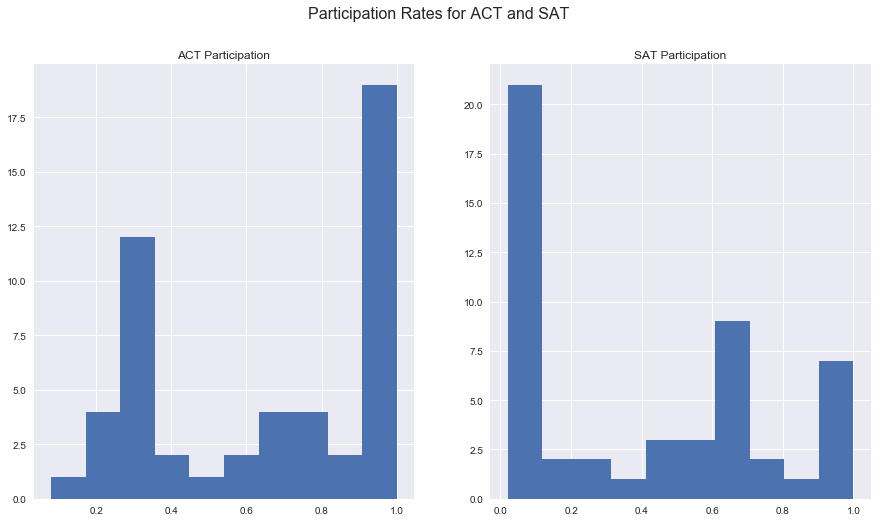


```python
# sat
```

##### 17. Plot the Math(s) distributions from both data sets.


```python
fig, ax = plt.subplots(1,2, figsize=(15,8))

fig.suptitle('Math Scores for ACT and SAT', fontsize=16)

ax[0].hist(both[both['state'] != 'std_dev'].loc[:,'math_act']);
ax[0].set(title='ACT Math');

ax[1].hist(both[both['state'] != 'std_dev'].loc[:,'math_sat']);
ax[1].set(title='SAT Math');
```


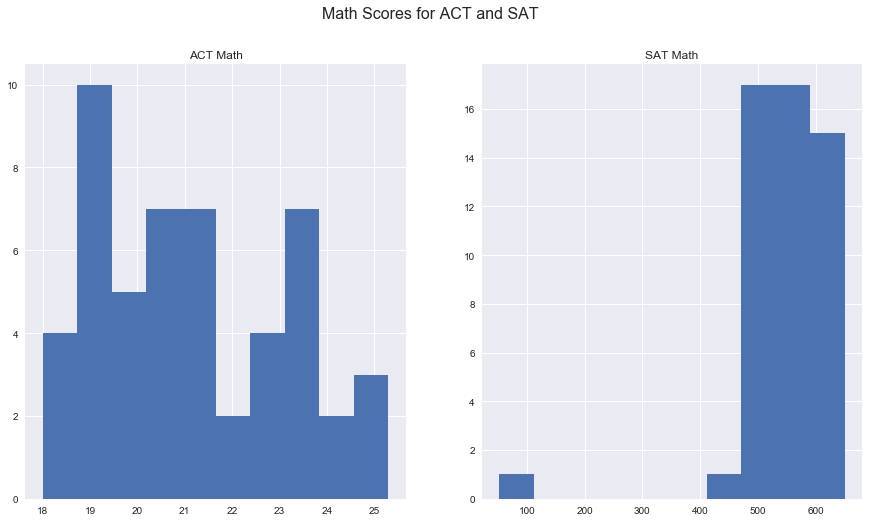


```python
tests = both.copy()
```


```python
tests.loc[21, 'math_sat'] = float(tests.loc[21, 'total_sat'] - tests.loc[21, 'evidence-based reading and writing_sat'])
```


```python
tests.loc[18:24]
```


<div>
<style scoped>
    .dataframe tbody tr th:only-of-type {
        vertical-align: middle;
    }

    .dataframe tbody tr th {
        vertical-align: top;
    }

    .dataframe thead th {
        text-align: right;
    }
</style>
<table border="1" class="dataframe">
  <thead>
    <tr style="text-align: right;">
      <th></th>
      <th>state</th>
      <th>participation_act</th>
      <th>english_act</th>
      <th>math_act</th>
      <th>reading_act</th>
      <th>science_act</th>
      <th>composite_act</th>
      <th>participation_sat</th>
      <th>evidence-based reading and writing_sat</th>
      <th>math_sat</th>
      <th>total_sat</th>
    </tr>
  </thead>
  <tbody>
    <tr>
      <th>18</th>
      <td>Kentucky</td>
      <td>1.00</td>
      <td>19.6</td>
      <td>19.4</td>
      <td>20.5</td>
      <td>20.1</td>
      <td>20.0</td>
      <td>0.04</td>
      <td>631.0</td>
      <td>616.0</td>
      <td>1247.0</td>
    </tr>
    <tr>
      <th>19</th>
      <td>Louisiana</td>
      <td>1.00</td>
      <td>19.4</td>
      <td>18.8</td>
      <td>19.8</td>
      <td>19.6</td>
      <td>19.5</td>
      <td>0.04</td>
      <td>611.0</td>
      <td>586.0</td>
      <td>1198.0</td>
    </tr>
    <tr>
      <th>20</th>
      <td>Maine</td>
      <td>0.08</td>
      <td>24.2</td>
      <td>24.0</td>
      <td>24.8</td>
      <td>23.7</td>
      <td>24.3</td>
      <td>0.95</td>
      <td>513.0</td>
      <td>499.0</td>
      <td>1012.0</td>
    </tr>
    <tr>
      <th>21</th>
      <td>Maryland</td>
      <td>0.28</td>
      <td>23.3</td>
      <td>23.1</td>
      <td>24.2</td>
      <td>23.0</td>
      <td>23.6</td>
      <td>0.69</td>
      <td>536.0</td>
      <td>524.0</td>
      <td>1060.0</td>
    </tr>
    <tr>
      <th>22</th>
      <td>Massachusetts</td>
      <td>0.29</td>
      <td>25.4</td>
      <td>25.3</td>
      <td>25.9</td>
      <td>24.7</td>
      <td>25.4</td>
      <td>0.76</td>
      <td>555.0</td>
      <td>551.0</td>
      <td>1107.0</td>
    </tr>
    <tr>
      <th>23</th>
      <td>Michigan</td>
      <td>0.29</td>
      <td>24.1</td>
      <td>23.7</td>
      <td>24.5</td>
      <td>23.8</td>
      <td>24.1</td>
      <td>1.00</td>
      <td>509.0</td>
      <td>495.0</td>
      <td>1005.0</td>
    </tr>
    <tr>
      <th>24</th>
      <td>Minnesota</td>
      <td>1.00</td>
      <td>20.4</td>
      <td>21.5</td>
      <td>21.8</td>
      <td>21.6</td>
      <td>21.5</td>
      <td>0.03</td>
      <td>644.0</td>
      <td>651.0</td>
      <td>1295.0</td>
    </tr>
  </tbody>
</table>
</div>


```python
fig, ax = plt.subplots(1,2, figsize=(15,8))

fig.suptitle('Math Scores for ACT and SAT', fontsize=16)

ax[0].hist(tests[tests['state'] != 'std_dev'].loc[:,'math_act']);
ax[0].set(title='ACT Math');

ax[1].hist(tests[tests['state'] != 'std_dev'].loc[:,'math_sat']);
ax[1].set(title='SAT Math');
```


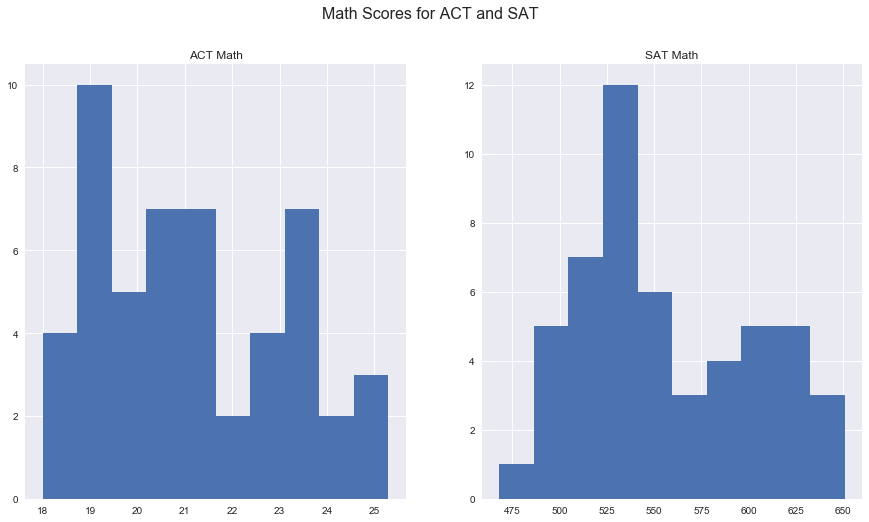


##### 18. Plot the Verbal distributions from both data sets.


```python
tests.head(2)
```


<div>
<style scoped>
    .dataframe tbody tr th:only-of-type {
        vertical-align: middle;
    }

    .dataframe tbody tr th {
        vertical-align: top;
    }

    .dataframe thead th {
        text-align: right;
    }
</style>
<table border="1" class="dataframe">
  <thead>
    <tr style="text-align: right;">
      <th></th>
      <th>state</th>
      <th>participation_act</th>
      <th>english_act</th>
      <th>math_act</th>
      <th>reading_act</th>
      <th>science_act</th>
      <th>composite_act</th>
      <th>participation_sat</th>
      <th>evidence-based reading and writing_sat</th>
      <th>math_sat</th>
      <th>total_sat</th>
    </tr>
  </thead>
  <tbody>
    <tr>
      <th>1</th>
      <td>Alabama</td>
      <td>1.00</td>
      <td>18.9</td>
      <td>18.4</td>
      <td>19.7</td>
      <td>19.4</td>
      <td>19.2</td>
      <td>0.05</td>
      <td>593.0</td>
      <td>572.0</td>
      <td>1165.0</td>
    </tr>
    <tr>
      <th>2</th>
      <td>Alaska</td>
      <td>0.65</td>
      <td>18.7</td>
      <td>19.8</td>
      <td>20.4</td>
      <td>19.9</td>
      <td>19.8</td>
      <td>0.38</td>
      <td>547.0</td>
      <td>533.0</td>
      <td>1080.0</td>
    </tr>
  </tbody>
</table>
</div>


```python
fig, ax = plt.subplots(1,3, figsize=(15,8))

fig.suptitle('Verbal Scores for ACT and SAT', fontsize=16)

ax[0].hist(tests[tests['state'] != 'std_dev'].loc[:,'english_act']);
ax[0].set(title='ACT English');

ax[1].hist(tests[tests['state'] != 'std_dev'].loc[:,'reading_act']);
ax[1].set(title='ACT Reading');

ax[2].hist(tests[tests['state'] != 'std_dev'].loc[:,'evidence-based reading and writing_sat']);
ax[2].set(title='SAT Verbal');
```


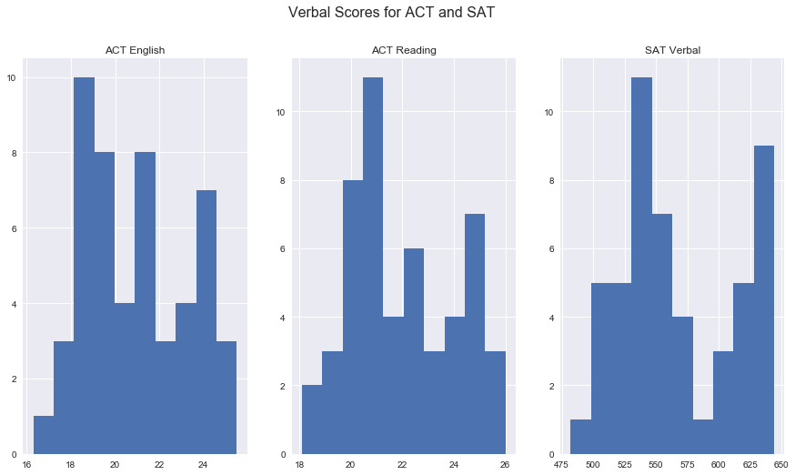


### Adding in z-score columns
**Here's what I'm trying to do:**
- Iteratively make new columns with '_zscore' append to each numeric column (probably a for loop)
- For each of those columns, iterate over each state row and calculate z-score, then put it in (probably .apply(lambda x: x- [whichever is appr. mean])
- Then I can use those values as color scales for visualization (in Tableau, or learn with Seaborn or Pyplot)


```python
# tests['math_sat']
dftestlist = [float(tests[tests['state'] == 'std_dev'][i].values) for i in list(tests.columns)[1:]]
```


```python
zscorenames = [i+'_zscore' for i in list(tests.columns)[1:]]
```


```python
zscorenames
```


    ['participation_act_zscore',
     'english_act_zscore',
     'math_act_zscore',
     'reading_act_zscore',
     'science_act_zscore',
     'composite_act_zscore',
     'participation_sat_zscore',
     'evidence-based reading and writing_sat_zscore',
     'math_sat_zscore',
     'total_sat_zscore']


```python
## use .map() or .apply()
```


```python
df = pd.DataFrame(np.random.randint(low=0, high=10, size=(5, 5)),columns=['a', 'b', 'c', 'd', 'e'])
```


```python
for i in tests.columns[1:]:
    for j in zscorenames:
        df[j] = tests[i].mean()
```


```python
tests['math_act'].mean()
```


    20.812739654371992


```python
df[[i+'_zscore' for i in list(tests.columns)[1:]][0]] = np.random.randint(1,10)
```


```python
df['participation_act_zscore'] = df['participation_act_zscore'].apply(lambda x: x - dftestlist[df.columns.get_loc('participation_act_zscore')])
```


```python
df.head()
```


<div>
<style scoped>
    .dataframe tbody tr th:only-of-type {
        vertical-align: middle;
    }

    .dataframe tbody tr th {
        vertical-align: top;
    }

    .dataframe thead th {
        text-align: right;
    }
</style>
<table border="1" class="dataframe">
  <thead>
    <tr style="text-align: right;">
      <th></th>
      <th>a</th>
      <th>b</th>
      <th>c</th>
      <th>d</th>
      <th>e</th>
      <th>participation_act_zscore</th>
      <th>english_act_zscore</th>
      <th>math_act_zscore</th>
      <th>reading_act_zscore</th>
      <th>science_act_zscore</th>
      <th>composite_act_zscore</th>
      <th>participation_sat_zscore</th>
      <th>evidence-based reading and writing_sat_zscore</th>
      <th>math_sat_zscore</th>
      <th>total_sat_zscore</th>
    </tr>
  </thead>
  <tbody>
    <tr>
      <th>0</th>
      <td>8</td>
      <td>2</td>
      <td>2</td>
      <td>5</td>
      <td>9</td>
      <td>4.999214</td>
      <td>1106.203529</td>
      <td>1106.203529</td>
      <td>1106.203529</td>
      <td>1106.203529</td>
      <td>1106.203529</td>
      <td>1106.203529</td>
      <td>1106.203529</td>
      <td>1106.203529</td>
      <td>1106.203529</td>
    </tr>
    <tr>
      <th>1</th>
      <td>4</td>
      <td>5</td>
      <td>1</td>
      <td>0</td>
      <td>1</td>
      <td>4.999214</td>
      <td>1106.203529</td>
      <td>1106.203529</td>
      <td>1106.203529</td>
      <td>1106.203529</td>
      <td>1106.203529</td>
      <td>1106.203529</td>
      <td>1106.203529</td>
      <td>1106.203529</td>
      <td>1106.203529</td>
    </tr>
    <tr>
      <th>2</th>
      <td>8</td>
      <td>5</td>
      <td>4</td>
      <td>2</td>
      <td>8</td>
      <td>4.999214</td>
      <td>1106.203529</td>
      <td>1106.203529</td>
      <td>1106.203529</td>
      <td>1106.203529</td>
      <td>1106.203529</td>
      <td>1106.203529</td>
      <td>1106.203529</td>
      <td>1106.203529</td>
      <td>1106.203529</td>
    </tr>
    <tr>
      <th>3</th>
      <td>8</td>
      <td>5</td>
      <td>1</td>
      <td>4</td>
      <td>6</td>
      <td>4.999214</td>
      <td>1106.203529</td>
      <td>1106.203529</td>
      <td>1106.203529</td>
      <td>1106.203529</td>
      <td>1106.203529</td>
      <td>1106.203529</td>
      <td>1106.203529</td>
      <td>1106.203529</td>
      <td>1106.203529</td>
    </tr>
    <tr>
      <th>4</th>
      <td>3</td>
      <td>7</td>
      <td>1</td>
      <td>9</td>
      <td>7</td>
      <td>4.999214</td>
      <td>1106.203529</td>
      <td>1106.203529</td>
      <td>1106.203529</td>
      <td>1106.203529</td>
      <td>1106.203529</td>
      <td>1106.203529</td>
      <td>1106.203529</td>
      <td>1106.203529</td>
      <td>1106.203529</td>
    </tr>
  </tbody>
</table>
</div>


##### 19. When we make assumptions about how data are distributed, what is the most common assumption?

**A:** Generally we tend to assume it's normally distributed, if anything

##### 20. Does this assumption hold true for any of our columns? Which?


```python
for i in range(len(tests.columns[1:])):
    print(tests.columns[i+1])
```

    participation_act
    english_act
    math_act
    reading_act
    science_act
    composite_act
    participation_sat
    evidence-based reading and writing_sat
    math_sat
    total_sat
    


```python
tests['science_act'][21] = 23.0
```

    C:\Users\james\Anaconda3\envs\dsi\lib\site-packages\ipykernel\__main__.py:1: SettingWithCopyWarning: 
    A value is trying to be set on a copy of a slice from a DataFrame
    
    See the caveats in the documentation: http://pandas.pydata.org/pandas-docs/stable/indexing.html#indexing-view-versus-copy
      if __name__ == '__main__':
    


```python
fig, ax = plt.subplots(nrows=len(tests.columns[1:]), ncols=1, figsize=(10, 40));

for i in range(len(tests.columns[1:])):
    sns.distplot(
        tests[tests['state'] != 'std_dev'].loc[:,tests.columns[i+1]],
        ax=ax[i],
        kde=True);
    
#     ax[i].set_ylabel(tests.columns[i+1]);
```

    C:\Users\james\Anaconda3\envs\dsi\lib\site-packages\matplotlib\axes\_axes.py:6462: UserWarning: The 'normed' kwarg is deprecated, and has been replaced by the 'density' kwarg.
      warnings.warn("The 'normed' kwarg is deprecated, and has been "
    


**A:** If anything, Science ACT scores are closes, but most look multi-modal or very skewed

##### 21. Plot some scatterplots examining relationships between all variables.


```python
# making some things easy on myself by dropping 'std_dev' row
new = tests.drop(52, axis=0)
```


```python
new.tail(3)
```


<div>
<style scoped>
    .dataframe tbody tr th:only-of-type {
        vertical-align: middle;
    }

    .dataframe tbody tr th {
        vertical-align: top;
    }

    .dataframe thead th {
        text-align: right;
    }
</style>
<table border="1" class="dataframe">
  <thead>
    <tr style="text-align: right;">
      <th></th>
      <th>state</th>
      <th>participation_act</th>
      <th>english_act</th>
      <th>math_act</th>
      <th>reading_act</th>
      <th>science_act</th>
      <th>composite_act</th>
      <th>participation_sat</th>
      <th>evidence-based reading and writing_sat</th>
      <th>math_sat</th>
      <th>total_sat</th>
    </tr>
  </thead>
  <tbody>
    <tr>
      <th>49</th>
      <td>West Virginia</td>
      <td>0.69</td>
      <td>20.0</td>
      <td>19.4</td>
      <td>21.2</td>
      <td>20.5</td>
      <td>20.4</td>
      <td>0.14</td>
      <td>558.0</td>
      <td>528.0</td>
      <td>1086.0</td>
    </tr>
    <tr>
      <th>50</th>
      <td>Wisconsin</td>
      <td>1.00</td>
      <td>19.7</td>
      <td>20.4</td>
      <td>20.6</td>
      <td>20.9</td>
      <td>20.5</td>
      <td>0.03</td>
      <td>642.0</td>
      <td>649.0</td>
      <td>1291.0</td>
    </tr>
    <tr>
      <th>51</th>
      <td>Wyoming</td>
      <td>1.00</td>
      <td>19.4</td>
      <td>19.8</td>
      <td>20.8</td>
      <td>20.6</td>
      <td>20.2</td>
      <td>0.03</td>
      <td>626.0</td>
      <td>604.0</td>
      <td>1230.0</td>
    </tr>
  </tbody>
</table>
</div>


```python
sns.heatmap(new.corr());
```


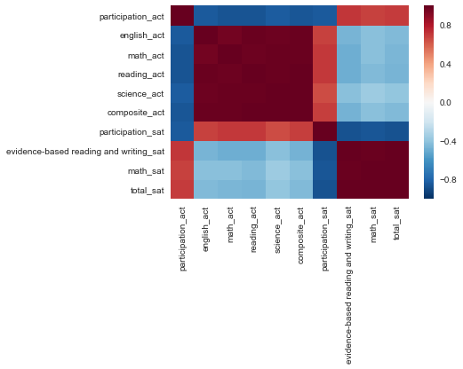


```python
sns.heatmap(abs(new.corr()));
```


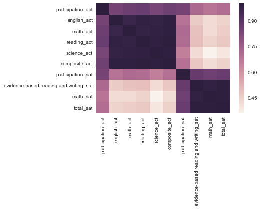


```python
# sns.pairplot(new);
```

##### 22. Are there any interesting relationships to note?

**A:** ACT and SAT scores appear to be weakly _negatively_ correlated

##### 23. Create box plots for each variable. 


```python
fig, ax = plt.subplots(nrows=len(tests.columns[1:]), ncols=1, figsize=(10, 40));

for i in range(len(tests.columns[1:])):
    sns.distplot(
        tests[tests['state'] != 'std_dev'].loc[:,tests.columns[i+1]],
        ax=ax[i],
        kde=True);
```

    C:\Users\james\Anaconda3\envs\dsi\lib\site-packages\matplotlib\axes\_axes.py:6462: UserWarning: The 'normed' kwarg is deprecated, and has been replaced by the 'density' kwarg.
      warnings.warn("The 'normed' kwarg is deprecated, and has been "
    


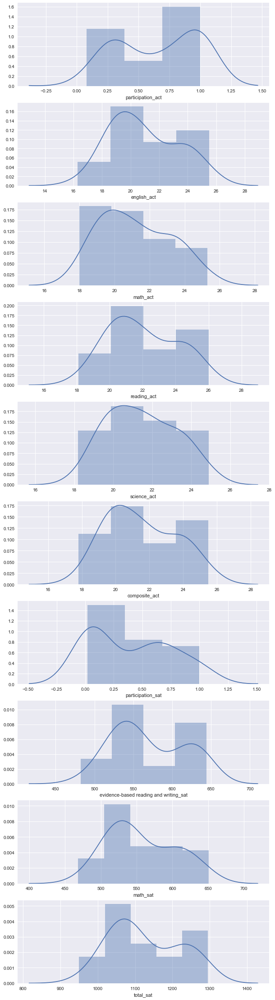


```python
fig, ax = plt.subplots(nrows=len(new.columns[1:]), ncols=1, figsize=(10,40));

for i in range(len(new.columns[1:])):
    sns.boxplot(new[new.columns[i+1]],
                notch=False,
                ax=ax[i]);
```

    C:\Users\james\Anaconda3\envs\dsi\lib\site-packages\seaborn\categorical.py:454: FutureWarning: remove_na is deprecated and is a private function. Do not use.
      box_data = remove_na(group_data)
    


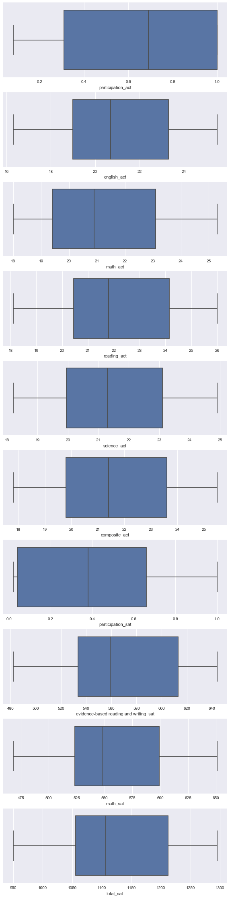


##### BONUS: Using Tableau, create a heat map for each variable using a map of the US. 


```python
new.to_csv('../data/merged_test_data.csv')
```

https://public.tableau.com/profile/jamiequella#!/vizhome/SAT_ACT/Dashboard1

## Step 4: Descriptive and Inferential Statistics

##### 24. Summarize each distribution. As data scientists, be sure to back up these summaries with statistics. (Hint: What are the three things we care about when describing distributions?)


```python
new.describe().T
```


<div>
<style scoped>
    .dataframe tbody tr th:only-of-type {
        vertical-align: middle;
    }

    .dataframe tbody tr th {
        vertical-align: top;
    }

    .dataframe thead th {
        text-align: right;
    }
</style>
<table border="1" class="dataframe">
  <thead>
    <tr style="text-align: right;">
      <th></th>
      <th>count</th>
      <th>mean</th>
      <th>std</th>
      <th>min</th>
      <th>25%</th>
      <th>50%</th>
      <th>75%</th>
      <th>max</th>
    </tr>
  </thead>
  <tbody>
    <tr>
      <th>participation_act</th>
      <td>51.0</td>
      <td>0.652549</td>
      <td>0.321408</td>
      <td>0.08</td>
      <td>0.31</td>
      <td>0.69</td>
      <td>1.00</td>
      <td>1.0</td>
    </tr>
    <tr>
      <th>english_act</th>
      <td>51.0</td>
      <td>20.931373</td>
      <td>2.353677</td>
      <td>16.30</td>
      <td>19.00</td>
      <td>20.70</td>
      <td>23.30</td>
      <td>25.5</td>
    </tr>
    <tr>
      <th>math_act</th>
      <td>51.0</td>
      <td>21.182353</td>
      <td>1.981989</td>
      <td>18.00</td>
      <td>19.40</td>
      <td>20.90</td>
      <td>23.10</td>
      <td>25.3</td>
    </tr>
    <tr>
      <th>reading_act</th>
      <td>51.0</td>
      <td>22.013725</td>
      <td>2.067271</td>
      <td>18.10</td>
      <td>20.45</td>
      <td>21.80</td>
      <td>24.15</td>
      <td>26.0</td>
    </tr>
    <tr>
      <th>science_act</th>
      <td>51.0</td>
      <td>21.447059</td>
      <td>1.735552</td>
      <td>18.20</td>
      <td>19.95</td>
      <td>21.30</td>
      <td>23.10</td>
      <td>24.9</td>
    </tr>
    <tr>
      <th>composite_act</th>
      <td>51.0</td>
      <td>21.519608</td>
      <td>2.020695</td>
      <td>17.80</td>
      <td>19.80</td>
      <td>21.40</td>
      <td>23.60</td>
      <td>25.5</td>
    </tr>
    <tr>
      <th>participation_sat</th>
      <td>51.0</td>
      <td>0.398039</td>
      <td>0.352766</td>
      <td>0.02</td>
      <td>0.04</td>
      <td>0.38</td>
      <td>0.66</td>
      <td>1.0</td>
    </tr>
    <tr>
      <th>evidence-based reading and writing_sat</th>
      <td>51.0</td>
      <td>569.117647</td>
      <td>45.666901</td>
      <td>482.00</td>
      <td>533.50</td>
      <td>559.00</td>
      <td>613.00</td>
      <td>644.0</td>
    </tr>
    <tr>
      <th>math_sat</th>
      <td>51.0</td>
      <td>556.882353</td>
      <td>47.121395</td>
      <td>468.00</td>
      <td>523.50</td>
      <td>548.00</td>
      <td>599.00</td>
      <td>651.0</td>
    </tr>
    <tr>
      <th>total_sat</th>
      <td>51.0</td>
      <td>1126.098039</td>
      <td>92.494812</td>
      <td>950.00</td>
      <td>1055.50</td>
      <td>1107.00</td>
      <td>1212.00</td>
      <td>1295.0</td>
    </tr>
  </tbody>
</table>
</div>


##### 25. Summarize each relationship. Be sure to back up these summaries with statistics.

##### 26. Execute a hypothesis test comparing the SAT and ACT participation rates. Use $\alpha = 0.05$. Be sure to interpret your results.


```python
import scipy.stats as stats
```


```python
new[['participation_act','participation_sat']].describe().T
```


<div>
<style scoped>
    .dataframe tbody tr th:only-of-type {
        vertical-align: middle;
    }

    .dataframe tbody tr th {
        vertical-align: top;
    }

    .dataframe thead th {
        text-align: right;
    }
</style>
<table border="1" class="dataframe">
  <thead>
    <tr style="text-align: right;">
      <th></th>
      <th>count</th>
      <th>mean</th>
      <th>std</th>
      <th>min</th>
      <th>25%</th>
      <th>50%</th>
      <th>75%</th>
      <th>max</th>
    </tr>
  </thead>
  <tbody>
    <tr>
      <th>participation_act</th>
      <td>51.0</td>
      <td>0.652549</td>
      <td>0.321408</td>
      <td>0.08</td>
      <td>0.31</td>
      <td>0.69</td>
      <td>1.00</td>
      <td>1.0</td>
    </tr>
    <tr>
      <th>participation_sat</th>
      <td>51.0</td>
      <td>0.398039</td>
      <td>0.352766</td>
      <td>0.02</td>
      <td>0.04</td>
      <td>0.38</td>
      <td>0.66</td>
      <td>1.0</td>
    </tr>
  </tbody>
</table>
</div>


```python
# def sampler(population, n=30, k=1000):
#     sample_means = []
    
#     for i in range(k):
#         sample = np.random.choice(population, size=n, replace=True)
#         sample_means.append(np.mean(sample))
    
#     return sample_means
```

#### Hypothesis Testing: Participation Rates
1. Construct null hypothesis (and alternative).
    - H0: The ACT participation rate is the same as SAT participation rate (difference in part. rates = 0)
    - H1: ACT_partic != SAT_partic (dif in part. rates != 0)
2. Specify a level of significance.
    - $\alpha = 0.05$

.   3. Calculate your point estimate


```python
experimental = new['participation_sat']
control = new['participation_act']
```

.   4. Calculate your test statistic


```python
stats.ttest_ind(experimental, control)
```


    Ttest_indResult(statistic=-3.8085778908170544, pvalue=0.00024134203698662353)


.    5. Find your p-value and make a conclusion


```python
alpha = 0.05
p_hyp = stats.ttest_ind(experimental, control)[1]
p_hyp < alpha
```


    True


Since p < $\alpha$, we have evidence to reject H0.

That is, the difference in participation rates between ACT and SAT across states is not 0, and not due to chance

##### 27. Generate and interpret 95% confidence intervals for SAT and ACT participation rates.


```python
def confidencer(sample, sd=0.95):
    """Take in sample and sig. level, then return CI
    sample = dataset
    sd = significance level, default 95%."""
    
    zscore = stats.norm.ppf(1-(1-sd)/2) 
    
    low_ci = sample.mean() - zscore*sample.sem()

    high_ci = sample.mean() + zscore*sample.sem()
    
#     interval = (low_ci, high_ci)
    print((low_ci, high_ci))

    print("{0:.0f}% of similar sample means will fall between the range above.".format(sd*100))
    
#     return (low_ci, high_ci)
```


```python
confidencer(new['participation_act'])
```

    (0.5643385258470263, 0.7407595133686601)
    95% of similar sample means will fall between the range above.
    


```python
confidencer(new['participation_sat'], .95)
```

    (0.3012225501733267, 0.49485588119922247)
    95% of similar sample means will fall between the range above.
    

##### 28. Given your answer to 26, was your answer to 27 surprising? Why?

**A:** No, because knowing that the part. rates are significantly different, I would expect them to have different ranges for the sample means we're getting the 95% confidence intervals for

##### 29. Is it appropriate to generate correlation between SAT and ACT math scores? Why?

##### 30. Suppose we only seek to understand the relationship between SAT and ACT data in 2017. Does it make sense to conduct statistical inference given the data we have? Why?

**A:** Yes, because this data comes from that year. From the README:
> These data give average SAT and ACT scores by state, as well as participation rates, for the graduating class of 2017.

## EDA FOR PRESENTATION

#### Some questions for myself to explore:
- What states have highest participation rates for ACT? SAT?
    - What can we infer about them?
    
    
- What can we learn from states that have high part. rates of both? Low rates of both?
- What states have the highest deltas btwn SAT and ACT part. rate?
    - Anything else we can learn from these?


- Do we know which states have mandatory testing for either SAT / ACT?

**Some final questions to explore as takeaways for the 'client' group:**
* Do we have any data in regards to college acceptance rates by state that we can correlate to SAT/ACT participation?
* Any median income or other data (5 yrs out) for those who took one test or another?
* Any data on colleges accepting SAT vs. ACT? Common app, etc?
* Is there any benefit to taking both tests? 
    * if not, do you want to throw eggs more into one basket vs. another?


```python
eda = new.copy()
```


```python
eda = eda.rename(columns={
    'participation_act':'act_participation',
    'english_act':'act_eng',
    'math_act':'act_math',
    'reading_act':'act_reading',
    'science_act':'act_sci',
    'composite_act':'act_composite',
    'participation_sat':'sat_participation',
    'evidence-based reading and writing_sat':'sat_erbw',
    'math_sat':'sat_math',
    'total_sat':'sat_total'
})
```


```python
eda.head(2)
```


<div>
<style scoped>
    .dataframe tbody tr th:only-of-type {
        vertical-align: middle;
    }

    .dataframe tbody tr th {
        vertical-align: top;
    }

    .dataframe thead th {
        text-align: right;
    }
</style>
<table border="1" class="dataframe">
  <thead>
    <tr style="text-align: right;">
      <th></th>
      <th>state</th>
      <th>act_participation</th>
      <th>act_eng</th>
      <th>act_math</th>
      <th>act_reading</th>
      <th>act_sci</th>
      <th>act_composite</th>
      <th>sat_participation</th>
      <th>sat_erbw</th>
      <th>sat_math</th>
      <th>sat_total</th>
    </tr>
  </thead>
  <tbody>
    <tr>
      <th>1</th>
      <td>Alabama</td>
      <td>1.00</td>
      <td>18.9</td>
      <td>18.4</td>
      <td>19.7</td>
      <td>19.4</td>
      <td>19.2</td>
      <td>0.05</td>
      <td>593.0</td>
      <td>572.0</td>
      <td>1165.0</td>
    </tr>
    <tr>
      <th>2</th>
      <td>Alaska</td>
      <td>0.65</td>
      <td>18.7</td>
      <td>19.8</td>
      <td>20.4</td>
      <td>19.9</td>
      <td>19.8</td>
      <td>0.38</td>
      <td>547.0</td>
      <td>533.0</td>
      <td>1080.0</td>
    </tr>
  </tbody>
</table>
</div>


```python
eda[['state','act_participation','sat_participation']].sort_values(by='act_participation', ascending=False)
```


<div>
<style scoped>
    .dataframe tbody tr th:only-of-type {
        vertical-align: middle;
    }

    .dataframe tbody tr th {
        vertical-align: top;
    }

    .dataframe thead th {
        text-align: right;
    }
</style>
<table border="1" class="dataframe">
  <thead>
    <tr style="text-align: right;">
      <th></th>
      <th>state</th>
      <th>act_participation</th>
      <th>sat_participation</th>
    </tr>
  </thead>
  <tbody>
    <tr>
      <th>1</th>
      <td>Alabama</td>
      <td>1.00</td>
      <td>0.05</td>
    </tr>
    <tr>
      <th>18</th>
      <td>Kentucky</td>
      <td>1.00</td>
      <td>0.04</td>
    </tr>
    <tr>
      <th>50</th>
      <td>Wisconsin</td>
      <td>1.00</td>
      <td>0.03</td>
    </tr>
    <tr>
      <th>45</th>
      <td>Utah</td>
      <td>1.00</td>
      <td>0.03</td>
    </tr>
    <tr>
      <th>43</th>
      <td>Tennessee</td>
      <td>1.00</td>
      <td>0.05</td>
    </tr>
    <tr>
      <th>41</th>
      <td>South Carolina</td>
      <td>1.00</td>
      <td>0.50</td>
    </tr>
    <tr>
      <th>37</th>
      <td>Oklahoma</td>
      <td>1.00</td>
      <td>0.07</td>
    </tr>
    <tr>
      <th>34</th>
      <td>North Carolina</td>
      <td>1.00</td>
      <td>0.49</td>
    </tr>
    <tr>
      <th>29</th>
      <td>Nevada</td>
      <td>1.00</td>
      <td>0.26</td>
    </tr>
    <tr>
      <th>27</th>
      <td>Montana</td>
      <td>1.00</td>
      <td>0.10</td>
    </tr>
    <tr>
      <th>25</th>
      <td>Mississippi</td>
      <td>1.00</td>
      <td>0.02</td>
    </tr>
    <tr>
      <th>24</th>
      <td>Minnesota</td>
      <td>1.00</td>
      <td>0.03</td>
    </tr>
    <tr>
      <th>19</th>
      <td>Louisiana</td>
      <td>1.00</td>
      <td>0.04</td>
    </tr>
    <tr>
      <th>26</th>
      <td>Missouri</td>
      <td>1.00</td>
      <td>0.03</td>
    </tr>
    <tr>
      <th>51</th>
      <td>Wyoming</td>
      <td>1.00</td>
      <td>0.03</td>
    </tr>
    <tr>
      <th>6</th>
      <td>Colorado</td>
      <td>1.00</td>
      <td>0.11</td>
    </tr>
    <tr>
      <th>4</th>
      <td>Arkansas</td>
      <td>1.00</td>
      <td>0.03</td>
    </tr>
    <tr>
      <th>35</th>
      <td>North Dakota</td>
      <td>0.98</td>
      <td>0.02</td>
    </tr>
    <tr>
      <th>14</th>
      <td>Illinois</td>
      <td>0.93</td>
      <td>0.09</td>
    </tr>
    <tr>
      <th>12</th>
      <td>Hawaii</td>
      <td>0.90</td>
      <td>0.55</td>
    </tr>
    <tr>
      <th>28</th>
      <td>Nebraska</td>
      <td>0.84</td>
      <td>0.03</td>
    </tr>
    <tr>
      <th>42</th>
      <td>South Dakota</td>
      <td>0.80</td>
      <td>0.03</td>
    </tr>
    <tr>
      <th>36</th>
      <td>Ohio</td>
      <td>0.75</td>
      <td>0.12</td>
    </tr>
    <tr>
      <th>10</th>
      <td>Florida</td>
      <td>0.73</td>
      <td>0.83</td>
    </tr>
    <tr>
      <th>17</th>
      <td>Kansas</td>
      <td>0.73</td>
      <td>0.04</td>
    </tr>
    <tr>
      <th>49</th>
      <td>West Virginia</td>
      <td>0.69</td>
      <td>0.14</td>
    </tr>
    <tr>
      <th>16</th>
      <td>Iowa</td>
      <td>0.67</td>
      <td>0.02</td>
    </tr>
    <tr>
      <th>32</th>
      <td>New Mexico</td>
      <td>0.66</td>
      <td>0.11</td>
    </tr>
    <tr>
      <th>2</th>
      <td>Alaska</td>
      <td>0.65</td>
      <td>0.38</td>
    </tr>
    <tr>
      <th>3</th>
      <td>Arizona</td>
      <td>0.62</td>
      <td>0.30</td>
    </tr>
    <tr>
      <th>11</th>
      <td>Georgia</td>
      <td>0.55</td>
      <td>0.61</td>
    </tr>
    <tr>
      <th>44</th>
      <td>Texas</td>
      <td>0.45</td>
      <td>0.62</td>
    </tr>
    <tr>
      <th>38</th>
      <td>Oregon</td>
      <td>0.40</td>
      <td>0.43</td>
    </tr>
    <tr>
      <th>13</th>
      <td>Idaho</td>
      <td>0.38</td>
      <td>0.93</td>
    </tr>
    <tr>
      <th>15</th>
      <td>Indiana</td>
      <td>0.35</td>
      <td>0.63</td>
    </tr>
    <tr>
      <th>31</th>
      <td>New Jersey</td>
      <td>0.34</td>
      <td>0.70</td>
    </tr>
    <tr>
      <th>9</th>
      <td>District of Columbia</td>
      <td>0.32</td>
      <td>1.00</td>
    </tr>
    <tr>
      <th>7</th>
      <td>Connecticut</td>
      <td>0.31</td>
      <td>1.00</td>
    </tr>
    <tr>
      <th>5</th>
      <td>California</td>
      <td>0.31</td>
      <td>0.53</td>
    </tr>
    <tr>
      <th>33</th>
      <td>New York</td>
      <td>0.31</td>
      <td>0.67</td>
    </tr>
    <tr>
      <th>23</th>
      <td>Michigan</td>
      <td>0.29</td>
      <td>1.00</td>
    </tr>
    <tr>
      <th>22</th>
      <td>Massachusetts</td>
      <td>0.29</td>
      <td>0.76</td>
    </tr>
    <tr>
      <th>46</th>
      <td>Vermont</td>
      <td>0.29</td>
      <td>0.60</td>
    </tr>
    <tr>
      <th>47</th>
      <td>Virginia</td>
      <td>0.29</td>
      <td>0.65</td>
    </tr>
    <tr>
      <th>48</th>
      <td>Washington</td>
      <td>0.29</td>
      <td>0.64</td>
    </tr>
    <tr>
      <th>21</th>
      <td>Maryland</td>
      <td>0.28</td>
      <td>0.69</td>
    </tr>
    <tr>
      <th>39</th>
      <td>Pennsylvania</td>
      <td>0.23</td>
      <td>0.65</td>
    </tr>
    <tr>
      <th>40</th>
      <td>Rhode Island</td>
      <td>0.21</td>
      <td>0.71</td>
    </tr>
    <tr>
      <th>8</th>
      <td>Delaware</td>
      <td>0.18</td>
      <td>1.00</td>
    </tr>
    <tr>
      <th>30</th>
      <td>New Hampshire</td>
      <td>0.18</td>
      <td>0.96</td>
    </tr>
    <tr>
      <th>20</th>
      <td>Maine</td>
      <td>0.08</td>
      <td>0.95</td>
    </tr>
  </tbody>
</table>
</div>


```python
# creating a column that measures difference in ACT and SAT participation
eda['particip_dif_act_sat'] = eda['act_participation'] - eda['sat_participation']
```


```python

fig, ax = plt.subplots(figsize=(15,10));
ax = plt.gca();
eda['particip_dif_act_sat'].sort_values().plot(kind='barh', color='mediumorchid');
ax.set_yticklabels([i for i in eda['state'][eda['particip_dif_act_sat'].sort_values().index]]);
```


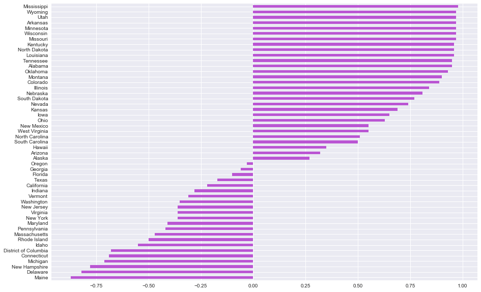


```python
eda.loc[SO.index, 'state'].values
```


    array(['Alabama', 'Arkansas', 'Delaware', 'District of Columbia',
           'Florida', 'Georgia', 'Kentucky', 'Louisiana', 'Maryland',
           'Mississippi', 'North Carolina', 'Oklahoma', 'South Carolina',
           'Tennessee', 'Texas', 'Virginia', 'West Virginia'], dtype=object)


```python
SO = eda[eda['region']=='South']['particip_dif_act_sat']
WE = eda[eda['region']=='West']['particip_dif_act_sat']
NE = eda[eda['region']=='Northeast']['particip_dif_act_sat']
MW = eda[eda['region']=='Midwest']['particip_dif_act_sat']

fig, ax = plt.subplots(nrows=2, ncols=2, figsize=(15,10));

width = 2
size = 14

ax[0,0].barh(y=eda.loc[SO.sort_values().index, 'state'].values, width=SO.sort_values(), color='mediumorchid');
ax[0,0].axvline(x=0, color='gray', linewidth=width);
ax[0,0].set_title('South Region', fontsize=size);
ax[0,0].set_xlim(left=-1, right=1);
ax[0,0].tick_params(labelleft=False);

ax[0,1].barh(y=eda.loc[WE.sort_values().index, 'state'].values, width=WE.sort_values(), color='mediumseagreen');
ax[0,1].axvline(x=0, color='gray', linewidth=width);
ax[0,1].set_title('West Region', fontsize=size);
ax[0,1].set_xlim(left=-1, right=1);
ax[0,1].tick_params(labelleft=False);

ax[1,0].barh(y=eda.loc[NE.sort_values().index, 'state'].values, width=NE.sort_values(), color='mediumslateblue');
ax[1,0].axvline(x=0, color='gray', linewidth=width);
ax[1,0].set_title('Northeast Region', fontsize=size);
ax[1,0].set_xlim(left=-1, right=1);
ax[1,0].tick_params(labelleft=False);

ax[1,1].barh(y=eda.loc[MW.sort_values().index, 'state'].values, width=MW.sort_values(), color='salmon');
ax[1,1].axvline(x=0, color='gray', linewidth=width);
ax[1,1].set_title('Midwest Region', fontsize=size);
ax[1,1].set_xlim(left=-1, right=1);
ax[1,1].tick_params(labelleft=False);
```


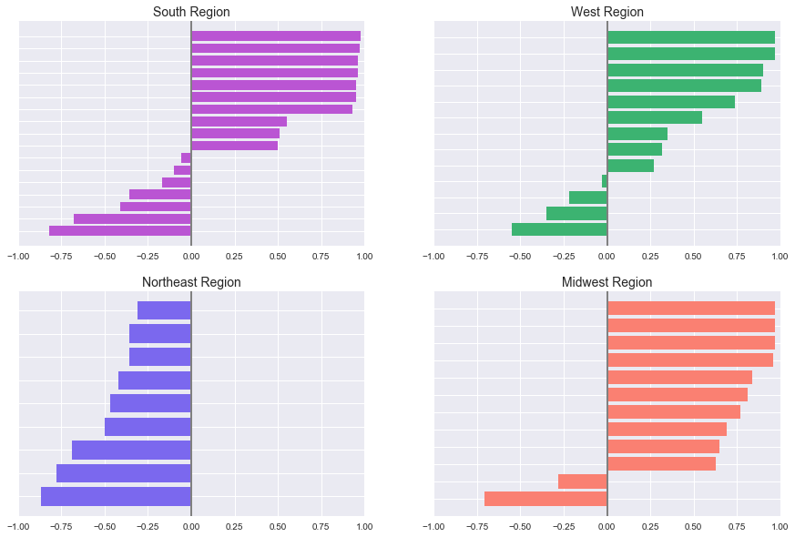


```python
# Checking out South

# getting aggregate data for South, just SAT participation
agg = eda[eda['region'] == 'South']['sat_participation'].sort_values()

#setting xtick labels
xlabs = [eda.iloc[i-1,0] for i in agg.index]

#setting up figsize
fig, ax = plt.subplots(nrows=1, ncols=1, figsize=(10,6));

#barplot by region for ACT participation
agg.plot(kind='bar', ax=fig.gca(), color='mediumseagreen');


#setting some labels
ax.set_xticklabels(xlabs, fontsize=14);
ax.set_xlabel('South',fontsize=14);
ax.set_ylabel('SAT Participation Rate', fontsize=14);
```


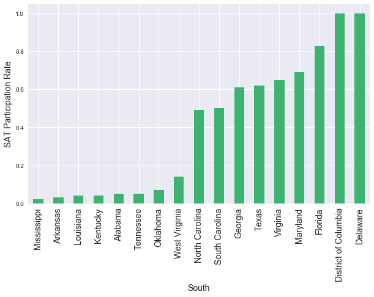


```python
# make column that is total test participation (may be over 1.0??)
```


```python
eda['particip_total'] = eda['act_participation'] + eda['sat_participation']
```


```python
xlabs = [i for i in eda['state'][eda['particip_total'].sort_values().index]]

fig, ax = plt.subplots(figsize=(15,10));
ax = plt.gca();

eda['particip_total'].sort_values(ascending=False).plot(kind='bar', color='lightsteelblue');

ax.set_xticklabels(xlabs, fontsize=14);
```


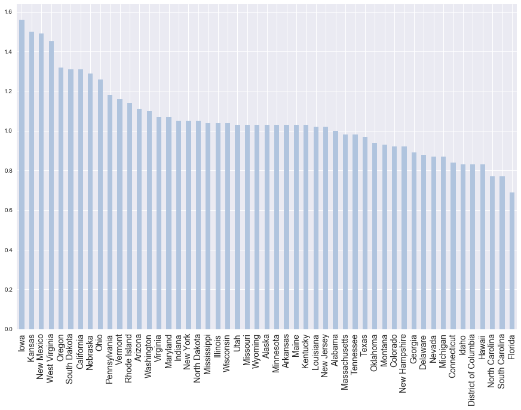


#### Creating a regional map for states to dig into the data a little deeper...

From here: https://en.wikipedia.org/wiki/List_of_regions_of_the_United_States#Interstate_regions


```python
# dict for state -> region
region_map = {'Connecticut': 'Northeast', 'Maine': 'Northeast', 'Massachusetts': 'Northeast',
             'New Hampshire': 'Northeast', 'Rhode Island': 'Northeast', 'Vermont': 'Northeast',
             'New Jersey': 'Northeast', 'New York': 'Northeast', 'Pennsylvania': 'Northeast',
             'Illinois': 'Midwest', 'Indiana': 'Midwest', 'Michigan': 'Midwest', 'Ohio': 'Midwest', 'Wisconsin': 'Midwest',
             'Iowa': 'Midwest', 'Kansas':'Midwest', 'Minnesota': 'Midwest', 'Missouri': 'Midwest', 'Nebraska': 'Midwest',
             'North Dakota':'Midwest', 'South Dakota': 'Midwest',
             'Delaware': 'South', 'Florida':'South', 'Georgia':'South', 'Maryland':'South', 'North Carolina':'South',
             'South Carolina':'South', 'Virginia':'South', 'District of Columbia':'South', 'West Virginia':'South',
             'West Virginia':'South', 'Alabama':'South', 'Kentucky':'South', 'Mississippi':'South', 'Tennessee':'South',
             'Arkansas':'South', 'Louisiana':'South', 'Oklahoma':'South', 'Texas':'South',
             'Arizona':'West', 'Colorado':'West', 'Idaho':'West', 'Montana':'West', 'Nevada':'West', 'New Mexico':'West',
             'Utah':'West', 'Wyoming':'West', 'Alaska':'West', 'California':'West', 'Hawaii':'West', 'Oregon':'West',
             'Washington':'West'}
```


```python
#creating a column to map a region for each state row
eda['region'] = [region_map[i] for i in eda['state']]
```


```python
eda.head()
```


<div>
<style scoped>
    .dataframe tbody tr th:only-of-type {
        vertical-align: middle;
    }

    .dataframe tbody tr th {
        vertical-align: top;
    }

    .dataframe thead th {
        text-align: right;
    }
</style>
<table border="1" class="dataframe">
  <thead>
    <tr style="text-align: right;">
      <th></th>
      <th>state</th>
      <th>act_participation</th>
      <th>act_eng</th>
      <th>act_math</th>
      <th>act_reading</th>
      <th>act_sci</th>
      <th>act_composite</th>
      <th>sat_participation</th>
      <th>sat_erbw</th>
      <th>sat_math</th>
      <th>sat_total</th>
      <th>particip_dif_act_sat</th>
      <th>particip_total</th>
      <th>region</th>
    </tr>
  </thead>
  <tbody>
    <tr>
      <th>1</th>
      <td>Alabama</td>
      <td>1.00</td>
      <td>18.9</td>
      <td>18.4</td>
      <td>19.7</td>
      <td>19.4</td>
      <td>19.2</td>
      <td>0.05</td>
      <td>593.0</td>
      <td>572.0</td>
      <td>1165.0</td>
      <td>0.95</td>
      <td>1.05</td>
      <td>South</td>
    </tr>
    <tr>
      <th>2</th>
      <td>Alaska</td>
      <td>0.65</td>
      <td>18.7</td>
      <td>19.8</td>
      <td>20.4</td>
      <td>19.9</td>
      <td>19.8</td>
      <td>0.38</td>
      <td>547.0</td>
      <td>533.0</td>
      <td>1080.0</td>
      <td>0.27</td>
      <td>1.03</td>
      <td>West</td>
    </tr>
    <tr>
      <th>3</th>
      <td>Arizona</td>
      <td>0.62</td>
      <td>18.6</td>
      <td>19.8</td>
      <td>20.1</td>
      <td>19.8</td>
      <td>19.7</td>
      <td>0.30</td>
      <td>563.0</td>
      <td>553.0</td>
      <td>1116.0</td>
      <td>0.32</td>
      <td>0.92</td>
      <td>West</td>
    </tr>
    <tr>
      <th>4</th>
      <td>Arkansas</td>
      <td>1.00</td>
      <td>18.9</td>
      <td>19.0</td>
      <td>19.7</td>
      <td>19.5</td>
      <td>19.4</td>
      <td>0.03</td>
      <td>614.0</td>
      <td>594.0</td>
      <td>1208.0</td>
      <td>0.97</td>
      <td>1.03</td>
      <td>South</td>
    </tr>
    <tr>
      <th>5</th>
      <td>California</td>
      <td>0.31</td>
      <td>22.5</td>
      <td>22.7</td>
      <td>23.1</td>
      <td>22.2</td>
      <td>22.8</td>
      <td>0.53</td>
      <td>531.0</td>
      <td>524.0</td>
      <td>1055.0</td>
      <td>-0.22</td>
      <td>0.84</td>
      <td>West</td>
    </tr>
  </tbody>
</table>
</div>


```python
eda.groupby(by='region')['particip_dif_act_sat'].mean()
```


    region
    Midwest      0.605833
    Northeast   -0.528889
    South        0.332941
    West         0.370000
    Name: particip_dif_act_sat, dtype: float64


```python
eda.groupby(by='region')['particip_dif_act_sat'].mean().index
```


    Index(['Midwest', 'Northeast', 'South', 'West'], dtype='object', name='region')


```python
# Checking out which regions over/under-index on ACT participation, compared to SAT participation

xlabs = [i for i in eda.groupby(by='region')['particip_dif_act_sat'].mean().index]

fig, ax = plt.subplots(figsize=(15,10));
ax = plt.gca();

eda.groupby(by='region')['particip_dif_act_sat'].mean().plot(kind='bar', color='g');

ax.set_xticklabels(xlabs, fontsize=14);
ax.set_xlabel('Region', fontsize=14);
ax.set_ylabel('Participation Rate Difference (ACT - SAT)', fontsize=14);

plt.axhline(y=0, linestyle='dashed', color='gray', linewidth=4, zorder=2);
```


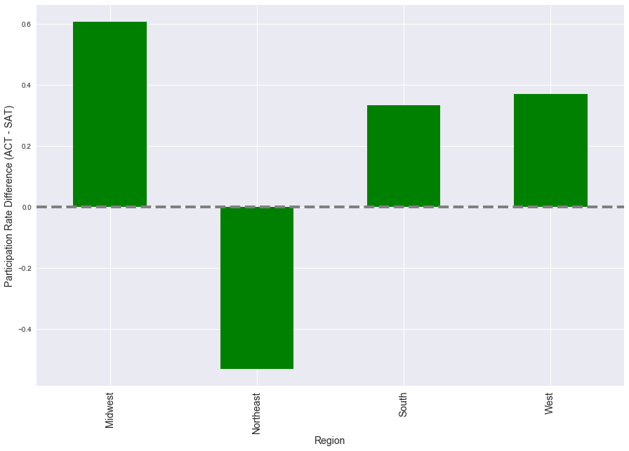


```python
# Checking out which regions over/under-index on ACT participation, compared to SAT participation

# getting aggregate data by region
agg = eda.groupby(by='region')[['act_participation', 'sat_participation']].mean()

#setting xtick labels
xlabs = [i for i in agg.index]

#setting up figsize
fig, ax = plt.subplots(nrows=1, ncols=1, figsize=(10,6));

#barplot by region for ACT and SAT participation
agg.plot(kind='bar', ax=fig.gca());


#setting some labels
ax.set_xticklabels(xlabs, fontsize=14);
ax.set_xlabel('Region',fontsize=14);
ax.set_ylabel('Test Participation Rate', fontsize=14);

ax.legend(('ACT Participation', 'SAT Participation'),fontsize=12);
```


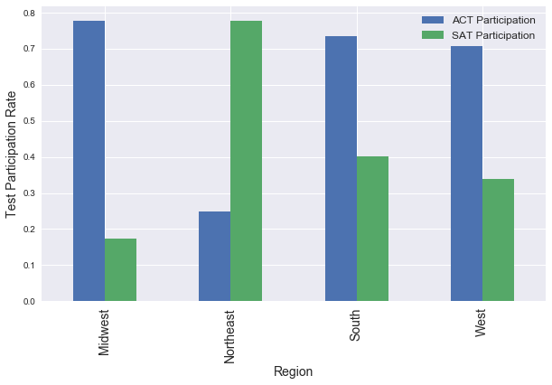


```python
agg = eda.groupby(by='region')[['act_participation', 'sat_participation']].mean()
agg
```


<div>
<style scoped>
    .dataframe tbody tr th:only-of-type {
        vertical-align: middle;
    }

    .dataframe tbody tr th {
        vertical-align: top;
    }

    .dataframe thead th {
        text-align: right;
    }
</style>
<table border="1" class="dataframe">
  <thead>
    <tr style="text-align: right;">
      <th></th>
      <th>act_participation</th>
      <th>sat_participation</th>
    </tr>
    <tr>
      <th>region</th>
      <th></th>
      <th></th>
    </tr>
  </thead>
  <tbody>
    <tr>
      <th>Midwest</th>
      <td>0.778333</td>
      <td>0.172500</td>
    </tr>
    <tr>
      <th>Northeast</th>
      <td>0.248889</td>
      <td>0.777778</td>
    </tr>
    <tr>
      <th>South</th>
      <td>0.734706</td>
      <td>0.401765</td>
    </tr>
    <tr>
      <th>West</th>
      <td>0.708462</td>
      <td>0.338462</td>
    </tr>
  </tbody>
</table>
</div>


```python
eda[eda['region'] == 'Northeast']
```


<div>
<style scoped>
    .dataframe tbody tr th:only-of-type {
        vertical-align: middle;
    }

    .dataframe tbody tr th {
        vertical-align: top;
    }

    .dataframe thead th {
        text-align: right;
    }
</style>
<table border="1" class="dataframe">
  <thead>
    <tr style="text-align: right;">
      <th></th>
      <th>state</th>
      <th>act_participation</th>
      <th>act_eng</th>
      <th>act_math</th>
      <th>act_reading</th>
      <th>act_sci</th>
      <th>act_composite</th>
      <th>sat_participation</th>
      <th>sat_erbw</th>
      <th>sat_math</th>
      <th>sat_total</th>
      <th>particip_dif_act_sat</th>
      <th>particip_total</th>
      <th>region</th>
    </tr>
  </thead>
  <tbody>
    <tr>
      <th>7</th>
      <td>Connecticut</td>
      <td>0.31</td>
      <td>25.5</td>
      <td>24.6</td>
      <td>25.6</td>
      <td>24.6</td>
      <td>25.2</td>
      <td>1.00</td>
      <td>530.0</td>
      <td>512.0</td>
      <td>1041.0</td>
      <td>-0.69</td>
      <td>1.31</td>
      <td>Northeast</td>
    </tr>
    <tr>
      <th>20</th>
      <td>Maine</td>
      <td>0.08</td>
      <td>24.2</td>
      <td>24.0</td>
      <td>24.8</td>
      <td>23.7</td>
      <td>24.3</td>
      <td>0.95</td>
      <td>513.0</td>
      <td>499.0</td>
      <td>1012.0</td>
      <td>-0.87</td>
      <td>1.03</td>
      <td>Northeast</td>
    </tr>
    <tr>
      <th>22</th>
      <td>Massachusetts</td>
      <td>0.29</td>
      <td>25.4</td>
      <td>25.3</td>
      <td>25.9</td>
      <td>24.7</td>
      <td>25.4</td>
      <td>0.76</td>
      <td>555.0</td>
      <td>551.0</td>
      <td>1107.0</td>
      <td>-0.47</td>
      <td>1.05</td>
      <td>Northeast</td>
    </tr>
    <tr>
      <th>30</th>
      <td>New Hampshire</td>
      <td>0.18</td>
      <td>25.4</td>
      <td>25.1</td>
      <td>26.0</td>
      <td>24.9</td>
      <td>25.5</td>
      <td>0.96</td>
      <td>532.0</td>
      <td>520.0</td>
      <td>1052.0</td>
      <td>-0.78</td>
      <td>1.14</td>
      <td>Northeast</td>
    </tr>
    <tr>
      <th>31</th>
      <td>New Jersey</td>
      <td>0.34</td>
      <td>23.8</td>
      <td>23.8</td>
      <td>24.1</td>
      <td>23.2</td>
      <td>23.9</td>
      <td>0.70</td>
      <td>530.0</td>
      <td>526.0</td>
      <td>1056.0</td>
      <td>-0.36</td>
      <td>1.04</td>
      <td>Northeast</td>
    </tr>
    <tr>
      <th>33</th>
      <td>New York</td>
      <td>0.31</td>
      <td>23.8</td>
      <td>24.0</td>
      <td>24.6</td>
      <td>23.9</td>
      <td>24.2</td>
      <td>0.67</td>
      <td>528.0</td>
      <td>523.0</td>
      <td>1052.0</td>
      <td>-0.36</td>
      <td>0.98</td>
      <td>Northeast</td>
    </tr>
    <tr>
      <th>39</th>
      <td>Pennsylvania</td>
      <td>0.23</td>
      <td>23.4</td>
      <td>23.4</td>
      <td>24.2</td>
      <td>23.3</td>
      <td>23.7</td>
      <td>0.65</td>
      <td>540.0</td>
      <td>531.0</td>
      <td>1071.0</td>
      <td>-0.42</td>
      <td>0.88</td>
      <td>Northeast</td>
    </tr>
    <tr>
      <th>40</th>
      <td>Rhode Island</td>
      <td>0.21</td>
      <td>24.0</td>
      <td>23.3</td>
      <td>24.7</td>
      <td>23.4</td>
      <td>24.0</td>
      <td>0.71</td>
      <td>539.0</td>
      <td>524.0</td>
      <td>1062.0</td>
      <td>-0.50</td>
      <td>0.92</td>
      <td>Northeast</td>
    </tr>
    <tr>
      <th>46</th>
      <td>Vermont</td>
      <td>0.29</td>
      <td>23.3</td>
      <td>23.1</td>
      <td>24.4</td>
      <td>23.2</td>
      <td>23.6</td>
      <td>0.60</td>
      <td>562.0</td>
      <td>551.0</td>
      <td>1114.0</td>
      <td>-0.31</td>
      <td>0.89</td>
      <td>Northeast</td>
    </tr>
  </tbody>
</table>
</div>


```python
# Checking out NE

# getting aggregate data for NE, just ACT participation
agg = eda[eda['region'] == 'Northeast']['act_participation'].sort_values()

#setting xtick labels
xlabs = [eda.iloc[i-1,0] for i in agg.index]

#setting up figsize
fig, ax = plt.subplots(nrows=1, ncols=1, figsize=(10,6));

#barplot by region for ACT participation
agg.plot(kind='bar', ax=fig.gca(), color='lightsteelblue');


#setting some labels
ax.set_xticklabels(xlabs, fontsize=14);
ax.set_xlabel('Northeast',fontsize=14);
ax.set_ylabel('ACT Participation Rate', fontsize=14);

# ax.legend(('ACT Participation', ''),fontsize=12);
```


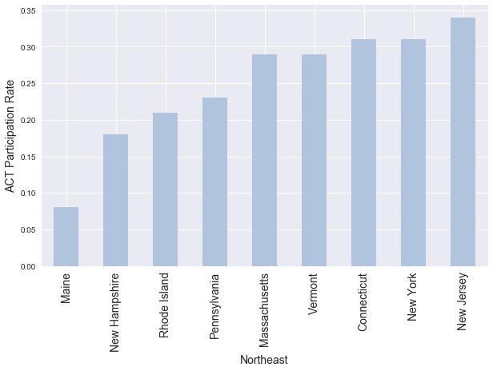


```python
# Checking out NE

# getting aggregate data for NE, just SAT participation
agg = eda[eda['region'] == 'Northeast']['sat_participation'].sort_values()

#setting xtick labels
xlabs = [eda.iloc[i-1,0] for i in agg.index]

#setting up figsize
fig, ax = plt.subplots(nrows=1, ncols=1, figsize=(10,6));

#barplot by region for SAT participation
agg.plot(kind='bar', ax=fig.gca(), color='lightsteelblue');


#setting some labels
ax.set_xticklabels(xlabs, fontsize=14);
ax.set_xlabel('Northeast',fontsize=14);
ax.set_ylabel('SAT Participation Rate', fontsize=14);

```


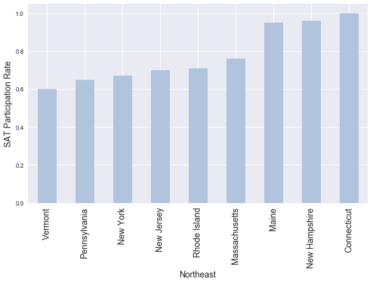


```python
# Checking out low SAT participation region

# getting aggregate data for MW, just SAT participation
agg = eda[eda['region'] == 'Midwest']['sat_participation'].sort_values()

#setting xtick labels
xlabs = [eda.iloc[i-1,0] for i in agg.index]

#setting up figsize
fig, ax = plt.subplots(nrows=1, ncols=1, figsize=(10,6));

#barplot by region for SAT participation
agg.plot(kind='bar', ax=fig.gca(), color='lightsteelblue');


#setting some labels
ax.set_xticklabels(xlabs, fontsize=14);
ax.set_xlabel('Midwest',fontsize=14);
ax.set_ylabel('SAT Participation Rate', fontsize=14);

# ax.legend(('ACT Participation', ''),fontsize=12);
```


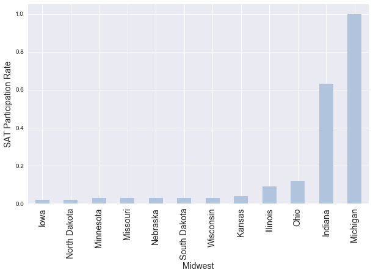


```python
# Checking out which regions over/under-index on ACT participation, compared to SAT participation

xlabs = [i for i in eda.groupby(by='region')['particip_dif_act_sat'].mean().index]

fig, ax = plt.subplots(figsize=(15,10));
ax = plt.gca();

plt.bar(x=xlabs, height=[i*-1 for i in eda.groupby(by='region')['particip_dif_act_sat'].mean()], color='r');

ax.set_xticklabels(xlabs, fontsize=14);
ax.set_xlabel('Region', fontsize=14);
ax.set_ylabel('Participation Rate Difference (SAT - ACT)', fontsize=14);
# ax.set_yticklabels(ax.yaxis.get_majorticklabels(), fontsize=14)

# ax.yaxis.get_major_ticks()

# label = ax.yaxis.get_major_ticks()
# label.set_fontsize(14);

plt.axhline(y=0, linestyle='dashed', color='gray', linewidth=4, zorder=2);
```


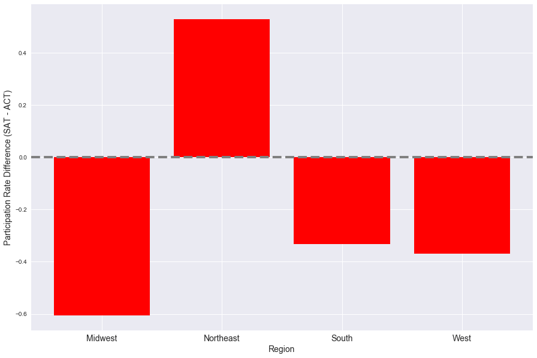

